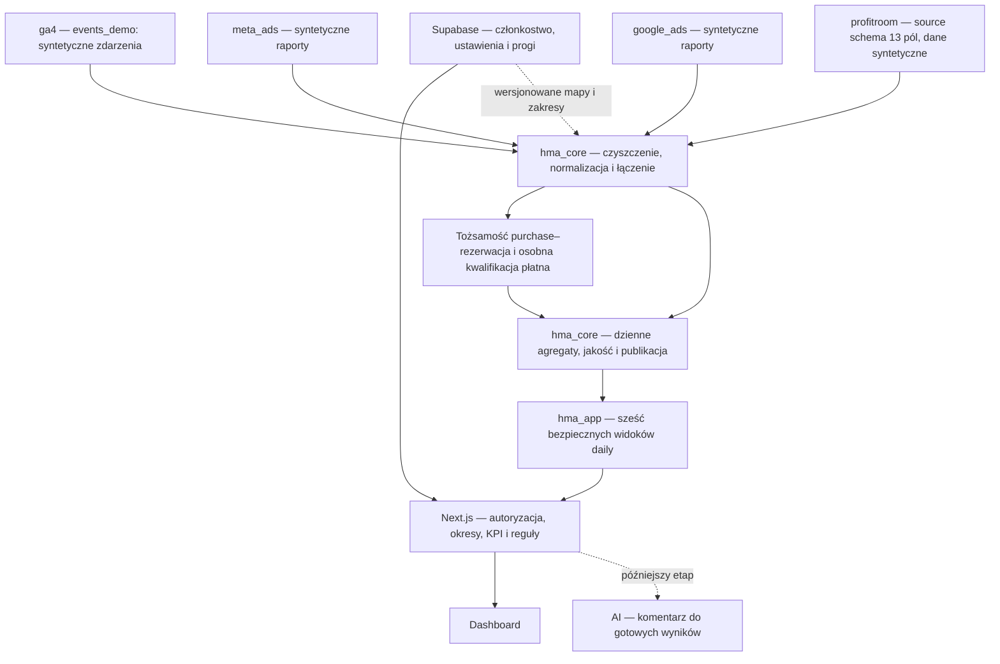

# Projekt techniczny BigQuery — Hotel Marketing Analyzer

Wersja projektu: **0.4 — zaakceptowana architektura BigQuery v1 z korektą katalogu lejka**. Data: 2026-09-09.

Etap 4 — Projekt BigQuery, krok 4.1. Podstawa: [zaakceptowany kontrakt analityczny 0.2](ANALYTICS_CONTRACT.md), commit `bb3e2dd` (`docs: accept analytics contract v1`).

**Zakres tego dokumentu:** projekt struktur, odpowiedzialności i późniejszego wdrożenia. Nazwy zasobów są propozycjami. Dokument nie tworzy zasobów, SQL, danych, poświadczeń ani integracji. Zaakceptowany kontrakt pozostaje bez zmian.

Oznaczenia: **USTALONE** oznacza zapis kontraktu lub jawną decyzję właścicielki; **PROPOZYCJA** oznacza rozwiązanie techniczne tego projektu; **OTWARTE** oznacza decyzję wymagającą uzgodnienia. O01–O14 w sekcji 14 tworzą pełny rejestr otwartych kwestii wraz z ryzykiem i momentem decyzji.

## Zmiana architektury — 2026-09-08

**USTALONE przez właścicielkę:** projekt `hotel-marketing-analyzer-demo` oraz sześć datasetów `ga4`, `meta_ads`, `google_ads`, `profitroom`, `hma_core`, `hma_app` zostały ręcznie utworzone w EU. Jest to informacja właścicielki, bez weryfikacji dostępu do chmury przez Codex. Właścicielka potwierdziła również ręczne utworzenie i weryfikację pustej tabeli `ga4.events_demo`; szczegóły odbioru zapisano w istniejącej checkliście w sekcji 13. Pozostałe tabele i ładowanie danych pozostają kolejnymi zadaniami.

Wcześniejsza architektura z datasetami `hma_raw`, `hma_mart` i `hma_ops` została zastąpiona. Nie są one częścią bieżącego projektu. Źródła otrzymują osobne datasety, a hma_core skupia czyszczenie, ujednolicanie i łączenie. **USTALONE:** pomocnicze agregaty, tabele oczyszczone i tabele łączące źródła znajdują się w hma_core. Rejestry operacyjne, historia uruchomień i osobne logi importów pozostają poza zakresem v1; hma_core ich nie zawiera. hma_app zawiera wyłącznie końcowe bezpieczne widoki. Jest to zmiana projektu dokumentacji, bez fizycznej migracji zasobów.

Kontrakt analityczny 0.2 i przedstawione niżej założenie konfiguracji raportowej w Supabase dokumentują wcześniejszy etap projektowy; nie opisują obecnego runtime. Poprzednia akceptacja projektu 0.2 jest historyczna; wersja 0.3 została zaakceptowana po zmianie datasetów.

## 1. Cel i wynik przeglądu repozytorium

Celem jest przygotowanie jednej sprawdzalnej drogi od obserwacji źródłowej do liczby w aplikacji. Właścicielka hotelu ma widzieć, z czego wynika wskaźnik, na jaki okres się odnosi i dlaczego czasem pozostaje niedostępny. Programista otrzymuje ziarno danych, klucze, typy, etapy przetwarzania i kontrakt odczytu.

**Aktualny stan implementacji:** BigQuery jest aktywną warstwą danych. Backend pobiera dane GA4, Meta Ads, Google Ads i Profitroom, a `/api/diagnostics` przygotowuje dane dla aplikacji i uruchamia modularny silnik diagnostyczny oraz Priority Engine. Supabase odpowiada wyłącznie za uwierzytelnianie użytkowników. Poniższy przegląd z 2026-09-06 jest historycznym punktem wyjścia, a nie opisem obecnego runtime.

Historyczny punkt wyjścia z przeglądu 2026-09-06:

- Gałąź `refactor/bigquery-foundation`; przed rozpoczęciem katalog roboczy czysty.
- Ostatnie commity: `bb3e2dd` — akceptacja kontraktu; `826a6b3` — migracja na Next.js; `70d737b` — demo z Auth; `571f585` — usunięcie demonstracyjnego bloku API; `d2e99cd` — notatka o teście wdrożenia.
- Root aplikacji: `prototype/`, standardowy Next.js 16.2.6, React 19.2.6, Node 24.x. W chwili przeglądu dashboard korzystał z lokalnego `demo-data.ts`; plik ten został później usunięty.
- Supabase obsługiwał Auth. Ówczesne założenie o przyszłym członkostwie, rolach i konfiguracji hotelu w Supabase nie zostało przyjęte jako opis obecnego runtime.
- W chwili przeglądu repozytorium miało `01 Koncept/`, `docs/`, `supabase/` i `prototype/`, a połączenie BigQuery nie było jeszcze gotowe. Historyczne pliki `supabase/` przeniesiono do `archive/supabase-legacy/`; BigQuery jest obecnie podłączone.

### 1.1. Przeczytane pliki i ich wpływ

| Pliki | Znaczenie dla projektu |
|---|---|
| `docs/ANALYTICS_CONTRACT.md` — pełna treść | Normatywne definicje, sześć widoków daily, pytania Q01–Q09, pięć warunków linked_booking_roas |
| `archive/supabase-legacy/01_schema.sql` | Historyczny PostgreSQL: okresowe agregaty, UUID, NUMERIC, statusy i progi; model nie jest docelowym modelem BigQuery |
| `archive/supabase-legacy/02_seed_synthetic.sql` | Starszy syntetyczny scenariusz, rezerwacje i diagnozy bez jednostkowych identyfikatorów łączenia |
| `archive/supabase-legacy/03_audit.sql`, `04_audit_summary.sql`, `08_v2_audit.sql` | Inspiracja dla kontroli sum, jakości, zgodności hotelu i zakresu; ich wyników nie traktuje się jako wykonanych kontroli BigQuery |
| `archive/supabase-legacy/05_readonly_policies.sql` | Historyczny publiczny odczyt danych syntetycznych; obecny odczyt aplikacji z BigQuery odbywa się po stronie serwera |
| `archive/supabase-legacy/06_demo_diagnosis_rpc.sql` | Historyczne RPC diagnozy; nie jest wywoływane przez obecną aplikację |
| `archive/supabase-legacy/07_v2_periods_and_sales.sql`, `archive/supabase-legacy/README.legacy.md` | Dwa okresy, dodatkowe pola i kanały; migracja pozostawia starsze kampanie i narracje, więc nie stanowi jednoznacznego seeda v1 |
| `prototype/lib/demo-data.ts` (usunięty) | Dawne nazwy pól, sumy kontrolne, agregat Meta i braki porównań; nie jest źródłem danych obecnego UI |
| `prototype/lib/marketing-metrics.ts`, `campaign-data-sufficiency.ts` (usunięte) | Dawne wzory i demonstracyjne progi; obecna diagnostyka działa w modularnym silniku serwerowym |
| `prototype/app/page.tsx` — ówczesne typy, filtrowanie i obliczenia | Historyczny stan frontendu; obecnie korzysta on z odpowiedzi `/api/diagnostics` |
| `prototype/proxy.ts`, `lib/supabase/client.ts`, `lib/supabase/server.ts` | Aktualna weryfikacja sesji i granica klient/serwer; Supabase służy wyłącznie do auth |
| `prototype/package.json`, `tsconfig.json` | Runtime i typy; pakiet BigQuery jest już podłączony |

Zinwentaryzowano śledzone pliki i konfiguracje bez odczytu plików środowiska. Historyczne tabele `analysis_periods`, `diagnoses` i `evaluation_thresholds` nie są kopiowane jako analityczne tabele BigQuery. `package_bookings` i `booking_value` mają niepotwierdzoną semantykę; ich przypisanie jest O09. Źródłowa tabela „Meta Ads — Łącznie” jest agregatem, a nie odrębną kampanią do dodania do sumy kampanii.

## 2. Podział odpowiedzialności i przepływ

**USTALONE:** Profitroom jest kanonicznym źródłem sprzedaży, Meta i Google raportują własne wyniki, a `transaction_id` identyfikuje relację purchase–rezerwacja. Dodatkowa obserwacja marketingowa kwalifikuje rezerwację do płatnego zakresu. Progi i konfiguracja hotelu są w Supabase. Serwer wylicza KPI dla dowolnego zakresu od–do i wcześniejszego okresu identycznej długości.

**PROPOZYCJA:** surowe obserwacje i uporządkowane dane są dostępne tylko dla procesu importu/przetwarzania. Aplikacja ma odczyt sześciu widoków nad opublikowanymi dziennymi agregatami. Proces przebudowy odbywa się raz dziennie.

Przerywane połączenie konfiguracji oznacza przyszły odczyt wersjonowanej konfiguracji, nie nową bazę ustawień w BigQuery. Proces zapisuje przy faktach identyfikator użytej konfiguracji i rezultat kwalifikacji. Wartości progów skuteczności pozostają w Supabase; końcowa pewność i ocena są wyliczane na serwerze.

## 3. Projekt, datasety i lokalizacja

**USTALONE:** istniejący według informacji właścicielki projekt demonstracyjny ma ID `hotel-marketing-analyzer-demo`. Wszystkie sześć datasetów znajduje się w **EU**. Strefa prezentacji danych pozostaje `Europe/Warsaw`. Lokalizacja datasetu jest niezależna od strefy czasu i pozostaje niezmienna w miejscu; przyszłe przenoszenie danych wymaga odrębnego planu.

Demo jest oddzielone od `creatic-503805` i nie otrzymuje automatycznego dostępu do innych projektów. Rzeczywisty eksport GA4 służył właścicielce wyłącznie jako referencja struktury. Do demo trafiają wyłącznie dane syntetyczne, bez rekordów klientów, ich identyfikatorów użytkowników i adresów odwiedzanych stron. Codex nie odczytuje tego eksportu ani danych chmurowych.

| Dataset | Rola | Planowane struktury i dostęp |
|---|---|---|
| `ga4` | Źródłowe zdarzenia GA4 z zachowaniem zagnieżdżeń | events_demo; dostęp procesu, bez bezpośredniego odczytu aplikacji |
| `meta_ads` | Źródłowe koszty i wyniki Meta | meta_ads_daily; własna polityka konwersji |
| `google_ads` | Źródłowe koszty i wyniki Google Ads | Campaign_demo, CampaignBasicStats_demo, CampaignConversionStats_demo, Customer_demo; odrębność od Organic |
| `profitroom` | Surowe rezerwacje w schemacie rzeczywistego źródła | reservations_demo: 13 nullable pól 1:1; canonical i ewentualny osobny eksport zdarzeń są odrębne |
| `hma_core` | Czyszczenie, ujednolicanie, deduplikacja i łączenie | Tabele oczyszczone, łączenie źródeł i pomocnicze agregaty; bez rejestrów operacyjnych; dostęp przetwarzania |
| `hma_app` | Końcowe, bezpieczne widoki aplikacyjne | Sześć widoków daily; serwerowy odczyt po autoryzacji hotelu |

W dalszym opisie raw oznacza rolę danych źródłowych w czterech datasetach, mart — rolę agregatów wewnątrz hma_core, rejestry operacyjne pozostają poza v1. Raw i mart nie są osobnymi datasetami. Projekt produkcyjny i jego ID pozostają przyszłą decyzją.

**USTALONE:** tabele ustawień hotelu, członkostwa i progów KPI pozostają w Supabase. BigQuery przechowuje wyłącznie odniesienia do wersji, wyniki normalizacji oraz fakty jakości. Projekt nie zakłada `hotel_thresholds` w BigQuery.

## 4. Wspólne typy, identyfikatory i czas

### 4.1. Typy i NULL

**PROPOZYCJA:** poniższe zestawy kolumn dotyczą tabel opisanych w sekcjach 5–8 z jawnymi wyjątkami źródłowymi; Profitroom w sekcji 5.5 zachowuje wyłącznie 13 pól. W listach kolumn `?` oznacza NULL dozwolone, brak `?` — wymagana wartość na tym etapie walidacji. Pola surowe mogą być niepoprawne lub nieznane; otrzymują kod jakości i pozostają poza zależnym obliczeniem zamiast domyślnej liczby.

| Typ BigQuery | Zastosowanie |
|---|---|
| `STRING` | UUID hotelu jako tekst; identyfikatory kont/kampanii; tokeny identyfikatorów; enumy i wersje |
| `INT64` | Liczniki zdarzeń, sesji i rezerwacji; source sequence; dni |
| `NUMERIC` | Kwoty i ułamkowe konwersje platformowe; dokładne składniki ilorazów |
| `TIMESTAMP` | Czas zdarzenia, utworzenia, zmiany i importu jako chwila UTC |
| `DATE` | `metric_date`, daty pobytu i zakresy importu |
| `BOOL` | Syntetyczność, aktywność, kwalifikacja, flagi kompletności |
| `ARRAY<STRING>` | Kody przyczyn, referencje do batchy; płaskie dane liczbowe pozostają scalar |
| `JSON` | Wyłącznie kontrolowany payload w raw lub diagnostyce; aplikacja odczytuje jawne typowane kolumny |

Kwoty w adapterze Next.js należy przenosić w sposób zachowujący dziesiętną dokładność do obliczenia i prezentacji; obecny TypeScript `number` nie rozstrzyga tego kontraktu transportowego (O14). Dla dużych `INT64` adapter również wymaga jawnej konwersji i kontroli zakresu.

`NULL` oznacza nieznany albo niedopuszczony wynik, `0` — potwierdzone zero. Kompletna partia bez rezerwacji może dać zero; brak partii daje `NO_DATA`. `SUM` pomijające NULL wymaga równoległej kontroli braków, aby częściowa suma pozostała oznaczona jako częściowa. Błędna waluta blokuje powiązane agregaty; v1 pracuje w walucie hotelu, demo PLN.

### 4.2. Zestawy metadanych

**RAW_META**, w źródłach poza jawnym wariantem GA4 z sekcji 5.3 i Profitroom z sekcji 5.5: `hotel_id STRING`, `batch_id STRING`, `raw_row_id STRING`, `source_record_key STRING?`, `source_revision STRING?`, `source_updated_at TIMESTAMP?`, `extracted_at TIMESTAMP`, `loaded_at TIMESTAMP`, `source_system STRING`, `ingest_date DATE`, `metric_date DATE?`, `source_timezone STRING?`, `source_payload JSON?`, `payload_hash STRING`, `is_synthetic BOOL`, `scenario_id STRING?`, `generator_version STRING?`. Dla demo ostatnie dwa pola są wymagane. `raw_row_id` opisuje pozycję z jednego eksportu; nie zastępuje klucza biznesowego.

**CORE_META**, w tabelach faktów z sekcji 6: `hotel_id STRING`, `metric_date DATE`, `date_basis STRING`, `as_of_at TIMESTAMP`, `processed_at TIMESTAMP`, `loaded_at TIMESTAMP`, `source_system STRING`, `batch_id STRING`, `source_batch_ids ARRAY<STRING>`, `contract_version STRING` = `0.2`, `transform_version STRING`, `config_version STRING?`, `is_synthetic BOOL`, `scenario_id STRING?`, `metric_status STRING`, `reason_codes ARRAY<STRING>`. `config_version` jest wymagane dla faktów zależnych od map/kwalifikacji. Brak takiej wersji daje stan niedostępności kwalifikacji.

**APP_META**, we wszystkich sześciu mart i sześciu app, dokładnie jak N.1 kontraktu: `hotel_id STRING`, `metric_date DATE`, `date_basis STRING`, `as_of_at TIMESTAMP`, `updated_at TIMESTAMP`, `source_watermark_at TIMESTAMP?`, `contract_version STRING`, `is_synthetic BOOL`, `metric_status STRING`, `reason_codes ARRAY<STRING>`. Wszystkie oprócz watermarku są wymagane. Tabele agregatów dodatkowo mają `release_id STRING`, `transform_version STRING`, `config_version STRING`, `loaded_at TIMESTAMP`, `source_system STRING`, `batch_id STRING` i `source_batch_ids ARRAY<STRING>`. Widoki udostępniają aktualny zatwierdzony zestaw; release_id jest oznaczeniem wersji danych, a nie odwołaniem do rejestru uruchomień.

**Podstawowa identyfikowalność v1:** pola techniczne są przechowywane bezpośrednio we właściwych tabelach, odpowiednio do źródła:

| Pole | Typ | Znaczenie |
|---|---|---|
| `loaded_at` | TIMESTAMP | Moment załadowania danego rekordu lub wyniku; odrębny od czasu zdarzenia i utworzenia rezerwacji |
| `source_system` | STRING | Jawne źródło, np. ga4, meta_ads, google_ads, profitroom; dla połączeń jawne oznaczenie wieloźródłowej transformacji |
| `batch_id` | STRING | Identyfikator partii danych; dla agregatu identyfikuje partię wyniku, a source_batch_ids zachowuje referencje do wejść |
| `is_synthetic` | BOOL | true dla wszystkich danych demo |

Pola te dotyczą tabel, których schemat je przewiduje. Profitroom source z sekcji 5.5 ma wyłącznie 13 pól; metadane hotelu, partii i syntetyczności są w manifeście, a później w warstwie canonical. `ingest_date` jest datą UTC wyprowadzoną z loaded_at. Źródłowy timestamp importu, jeśli występuje, może pozostać osobnym polem opisanym przez adapter. Metadane pozwalają odtworzyć pochodzenie dostępnych rekordów; same nie potwierdzają kompletności importu ani nie dokumentują nieudanego uruchomienia.

### 4.3. Klucze, relacje i semantyka dat

- Hotel: docelowo stabilny UUID z Supabase przenoszony jako `STRING`; każde łączenie danych hotelowych zawiera `hotel_id`. Zaakceptowany wyjątek pierwszego demo: `hotel_demo_001`. Mapowanie do członkostwa Supabase i drugi hotel testowy są odłożone do integracji/testów izolacji i nie blokują generatora GA4.
- Kampania: `(hotel_id, platform, account_id, campaign_id)`. Nazwa jest etykietą, nie kluczem. Brand to rozłączna etykieta wybranego podzbioru Google Ads.
- Rezerwacja: `(hotel_id, canonical_booking_id)`, wyprowadzony z przestrzeni Profitroom. Grupa o jednym ID jest jedną rezerwacją.
- Transakcja: `(hotel_id, transaction_namespace, transaction_token)`. Surowe ID i bezpieczny token mają audytowalne mapowanie przed agregacją.
- Zdarzenie: `(hotel_id, source_system, canonical_event_id)`. Klucz deterministyczny wymaga dostępnych pól źródła; sam timestamp + nazwa zdarzenia mogą kolidować (O05).
- Sesja: `(hotel_id, session_key)` uwzględniający property/stream i identyfikator przeglądarki. Przypisana do jednego dnia startu; reguła granicy sesji w O05.
- Journey: `(hotel_id, journey_definition_id, journey_id)` na dostępnym identyfikatorze urządzenia/przeglądarki; lifecycle i wiele wyników wymagają O05.
- Obserwacja marketingowa ma własny identyfikator; jeden purchase może mieć wiele obserwacji, lecz rezerwacja trafia raz do hotelowej wartości powiązanej.

Klucze w tym projekcie są regułami unikalności sprawdzanymi przed publikacją. BigQuery nie wymusza PK/FK; deklaracje ograniczeń można dodać dopiero przy zapewnionej integralności. [Klucze w BigQuery](https://docs.cloud.google.com/bigquery/docs/primary-foreign-keys).

| Czas | Znaczenie i wykorzystanie |
|---|---|
| `event_at` | Faktyczny czas obserwacji ruchu, zakupu lub kontaktu |
| `booking_created_at` | Pierwotne utworzenie rezerwacji; wyznacza `metric_date` sprzedaży |
| `source_updated_at` | Rewizja statusu/wartości w źródle; wybór aktualnej wersji |
| `check_in_date`, `check_out_date` | Kontekst przyszłego pobytu; osobny od daty sprzedaży |
| `extracted_at`, `loaded_at` | Pobranie i zapis; import nie zmienia daty biznesowej |
| `as_of_at`, `updated_at` | Stan danych i publikacja; pokazywane jako aktualność |
| `cohort_started_at` | Jeden moment przypisania journey do kohorty lejka |
| `outcome_at` | Wynik ścieżki; dla rezerwacji wynika z daty utworzenia Profitroom |

Dzień docelowy wyznacza `Europe/Warsaw`, z granicami lokalnych dni i poprawną zmianą czasu. Dzienne raporty platform w innej strefie pozostają oznaczone jako nieporównywalne do czasu zatwierdzenia transformacji (O04). Każde źródło docelowo wnosi dzień metryki przez adapter; Profitroom source zachowuje Data rezerwacji bez dodawania metric_date; w raw niepoprawna data pozostaje NULL i trafia do kontroli, nie do fikcyjnej daty.

## 5. Tabele raw — obserwacje źródłowe

To projekt wejścia adapterów i generatora syntetycznego, a nie deklaracja, że obecnie posiadamy takie eksporty. Domyślnie tabela dziedziczy RAW_META; wyjątki GA4 i Profitroom opisują sekcje 5.3 i 5.5. Profitroom nie dziedziczy poniższej partycji, klastrów ani klucza. Domyślna partycja pozostałych źródeł: **`ingest_date`**, aby zachować również późne rewizje starych dat. Klaster: **`hotel_id`**, następnie wskazane kolumny. PK fizyczny: `(hotel_id, batch_id, raw_row_id)`; klucz logiczny opisuje deduplikację między batchami.

### 5.1. `meta_ads.meta_ads_daily`

- Grain: jeden wiersz raportu Meta dla konta, kampanii, dnia i rodzaju rekordu: `delivery` lub `conversion`, w jednej rewizji eksportu. Koszt pochodzi z delivery; akcje z conversion. To typowana otoczka raportu źródłowego.
- Klucz logiczny: hotel + account + campaign + source_report_date + record_type + conversion_action + policy + source_breakdown_key. Puste zastosowanie to jawne `not_applicable`; nieznana akcja/polityka ma NULL i jakość.
- Klaster: `hotel_id, account_id, campaign_id, record_type`.
- Pola: `account_id STRING`, `campaign_id STRING`, `campaign_name STRING?`, `source_report_date DATE`, `record_type STRING`, `source_breakdown_key STRING`, `currency_code STRING?`, `ad_spend NUMERIC?`, `impressions INT64?`, `outbound_clicks INT64?`, `click_type STRING?`, `conversion_action STRING?`, `platform_conversions NUMERIC?`, `platform_revenue NUMERIC?`, `platform_attribution_model STRING?`, `platform_attribution_window STRING?`, `platform_date_basis STRING?`.
- Delivery ma koszt jeden raz. Jeśli eksport powtarza koszt przy akcjach, adapter zachowuje payload, a do modelu delivery wybiera jeden koszt kontrolowany sumą. Dodatkowe breakdowny są odrębnym zakresem importu, z kontrolą pokrywania sum.

### 5.2. Google Ads — cztery tabele source query schema 1:1

Wzorcem są widoki `my-story-sopot.my_story_sopot_dataset.ads_*_6604551350`, a nie techniczne tabele p_ads_*. Demo materializuje ich strukturę odczytu jako tabele:

| Tabela w google_ads | Wzorzec widoku | Liczba pól |
|---|---|---|
| Campaign_demo | ads_Campaign_6604551350 | 27 |
| CampaignBasicStats_demo | ads_CampaignBasicStats_6604551350 | 17 |
| CampaignConversionStats_demo | ads_CampaignConversionStats_6604551350 | 20 |
| Customer_demo | ads_Customer_6604551350 | 9 |

Nazwy, kolejność i typy są źródłowe; wszystkie pola nullable. `_LATEST_DATE` i `_DATA_DATE` pozostają polami DATE. `metrics_cost_micros` pozostaje INT64, bez przeliczania na PLN w source. Konwersje są FLOAT64 i zachowują `segments_conversion_action`, `segments_conversion_action_category`, `segments_conversion_action_name`, `metrics_conversions` i `metrics_conversions_value`. Schemat zachowuje segmenty źródłowe; nie zakłada jednego wiersza na dzień kampanii. Koszt z BasicStats nie jest powielany przez łączenie z wieloma akcjami ConversionStats.

To zastępuje wcześniejszy projekt google_ads_daily / daily_campaign_stats_demo. Wspólne kanoniczne pola i metadane opisane wcześniej nie są kolumnami tych czterech tabel. Dane hotelu i scenariusza pozostają poza source; przyszłe mapowanie należy do osobnej warstwy. Nie dodano partycjonowania ani clusteringu. Definicje w plikach 003a–003d są lokalne; nie zmieniono zasobów chmurowych. Kalibracja i rozdzielenie wyników platformowych pozostają bez zmian.

### 5.3. `ga4.events_demo` — projekt architektoniczny

**USTALONE:** syntetyczna tabela zachowuje najważniejsze elementy zagnieżdżonego eksportu GA4. Nazwy i typy odniesiono do [oficjalnego schematu eksportu GA4](https://support.google.com/analytics/answer/7029846?hl=en); zakresy źródeł ruchu opisuje [dokumentacja atrybucji GA4](https://developers.google.com/analytics/bigquery/traffic-attribution-data). Rzeczywisty eksport jest referencją struktury, a nie źródłem rekordów. To celowy podzbiór schematu, nie deklaracja pełnej zgodności z każdym wariantem eksportu.

**Grain:** jeden syntetyczny event jednej przeglądarki/urządzenia w strumieniu. `event_timestamp` ani user_pseudo_id samodzielnie nie są unikalnym kluczem. **USTALONE:** techniczny klucz `hotel_id + demo_event_id`; tożsamość batcha i rekordu zapewnia idempotencję importu, zaś deduplikacja biznesowa powstaje w core według O05. Identyfikatory użytkowników, transakcji, strumieni i kampanii są wygenerowane od podstaw.

| Pole / ścieżka | Typ BigQuery / tryb | Znaczenie i brak wartości |
|---|---|---|
| metric_date | DATE, wymagane | Obowiązujący dzień metryki w Europe/Warsaw wyprowadzony z event_timestamp; pole najwyższego poziomu, partycja i podstawa agregacji dziennych |
| event_date | STRING, wymagane | Dzień źródłowy YYYYMMDD; walidowany względem jawnej strefy źródła |
| event_timestamp | INT64, wymagane | Mikrosekundy od epoki UTC; core wyprowadza event_at TIMESTAMP |
| event_name | STRING, wymagane | Jedna z planowanych nazw poniżej |
| event_params | RECORD REPEATED, czyli ARRAY<STRUCT> | Lista parametrów; pusta lista oznacza brak parametrów |
| event_params.key | STRING | Nazwa parametru; duplikaty klucza wymagają kontroli przed spłaszczeniem |
| event_params.value | RECORD | Typowana wartość parametru |
| event_params.value.string_value | STRING, NULL dozwolone | Tekst parametru |
| event_params.value.int_value | INT64, NULL dozwolone | Całkowita wartość parametru |
| event_params.value.float_value / double_value | FLOAT64, NULL dozwolone | Pola źródłowe wartości zmiennoprzecinkowej; oczekiwany jeden nośnik wartości na parametr |
| user_pseudo_id | STRING, NULL dozwolone | Wyłącznie syntetyczny identyfikator; brak ogranicza sesje i journey |
| privacy_info | RECORD, NULL dozwolone | analytics_storage, ads_storage, uses_transient_token jako nullable STRING; stany zgód i nieznany pomiar |
| device | RECORD, NULL dozwolone | Podzbiór: category, operating_system jako nullable STRING; web_info.browser jako nullable STRING |
| traffic_source | RECORD, NULL dozwolone | name, source, medium jako nullable STRING; źródło pierwszego pozyskania użytkownika, osobne od sesji |
| session_traffic_source_last_click | RECORD, NULL dozwolone | Sesyjne dane atrybucji; podzbiory manual_campaign, google_ads_campaign i cross_channel_campaign, opisane poniżej |
| stream_id | STRING, wymagane w demo | Syntetyczny strumień przypisany do hotelu |
| platform | STRING, wymagane w demo | WEB dla planowanego scenariusza przeglądarkowego |
| ecommerce | RECORD, NULL dozwolone | Dane transakcji; brak dla zdarzeń innych niż zakup jest oczekiwany |
| ecommerce.transaction_id | STRING, NULL dozwolone | Syntetyczna tożsamość zakupu; wymagane dla scenariusza wiarygodnego połączenia |
| ecommerce.purchase_revenue | FLOAT64, NULL dozwolone | Wartość raportowana w zdarzeniu GA4; core waliduje i normalizuje do NUMERIC, waluta jawna |

**USTALONE — podzbiory atrybucji:** `session_traffic_source_last_click.manual_campaign` jest nullable RECORD z polami `campaign_id`, `campaign_name`, `source`, `medium`, `term`, `content`, `source_platform`, `creative_format`, `marketing_tactic` typu nullable STRING; `google_ads_campaign` jest nullable RECORD z `customer_id`, `account_name`, `campaign_id`, `campaign_name`, `ad_group_id`, `ad_group_name` typu nullable STRING. `cross_channel_campaign` jest nullable RECORD z polami `campaign_id`, `campaign_name`, `source`, `medium`, `source_platform`, `default_channel_group`, `primary_channel_group`, każde typu nullable STRING. Te trzy podzbiory są zatwierdzonym zakresem pierwszego DDL. Brak sesyjnego źródła nie jest automatycznie Direct; source pierwszego pozyskania nie zastępuje sesyjnego przypisania. Brand wymaga mapowania, a tożsamość transakcji pozostaje odrębna od dowodu płatnego marketingu.

**Otoczka demonstracyjna:** wymagane `hotel_id STRING`, `demo_event_id STRING`, `batch_id STRING`, `raw_row_id STRING`, `is_synthetic BOOL=true`, `scenario_id STRING`, `generator_version STRING`, `loaded_at TIMESTAMP`, `source_system STRING` = `ga4`, `ingest_date DATE`, `source_timezone STRING`. Pozostałe metadane RAW_META są propozycją rozszerzenia; tabela zachowuje natywne pola GA4 zamiast wymagać płaskich browser_token/event_at na wejściu. **USTALONE:** wymagane pole najwyższego poziomu `metric_date DATE` jest dniem metryki zgodnym z kontraktem: `DATE(TIMESTAMP_MICROS(event_timestamp), 'Europe/Warsaw')`. Obowiązuje `PARTITION BY metric_date` oraz `CLUSTER BY hotel_id, event_name, stream_id, user_pseudo_id` w tej kolejności. Opcja tabeli `require_partition_filter = TRUE` wymaga, aby każde zapytanie odczytujące `ga4.events_demo` ograniczało `metric_date` filtrem umożliwiającym eliminację partycji. Wartość metric_date dostarcza przyszły proces ładowania; zgodność z event_timestamp jest warunkiem walidacji danych, a nie automatycznym obliczeniem przez sam DDL. To jawny wyjątek od partycji ingest_date pozostałych źródeł. W core powstają normalizowane identyfikatory, sesje i zdarzenia.

**Zaakceptowany katalog 13 zdarzeń:** `session_start`, `page_view`, `user_engagement`, `engaged_view`, `step1_dates_and_rooms`, `step2_extras`, `step3_confirmation`, `purchase`, `click_tel`, `click_mail`, `form_submit`, `open_apartment_details`, `open_package_details`.

Zaakceptowana korekta katalogu w wersji 0.4 dotyczy wyłącznie nazwy trzeciego etapu przed purchase: step3_confirmation zastępuje dotychczasowe begin_checkout. Nie stwierdzono odrębnej, wcześniej zaakceptowanej definicji begin_checkout w dokumentach; opis przejścia do finalizacji występował w projekcie scenariusza. Katalog nadal obejmuje 13 zdarzeń, bez dwóch nazw tego samego etapu. Schemat DDL pozostaje bez zmian. Docelowe syntetyczne proporcje i kanałowe przejścia opisuje [zaakceptowany scenariusz 0.2](SYNTHETIC_DATA_SCENARIO.md).

Proponowane parametry obejmują ga_session_id, session_engaged, engagement_time_msec, currency oraz syntetyczne page_location/page_referrer. Adresy są generowane np. w domenie hotel-demo.example; kopiowanie rzeczywistych URL, query strings i identyfikatorów z referencji jest poza zakresem demo. Wartości i rozkłady GA4 zostały zatwierdzone w SYNTHETIC_DATA_SCENARIO.md 0.2: 12000 urządzeń/przeglądarek, 18000 sesji, lejek 18000 → 6840 → 1250 → 430 → 65 oraz łącznie 116015 zdarzeń. Obowiązują scenario_id=baltic_horizon_2026_v1, stream_id=demo_web_001, generator_version=ga4-demo-generator-v1 i seed=20260601. Zakres 1 czerwca–29 sierpnia 2026, as_of_at 30 sierpnia o 08:00 Europe/Warsaw, dzienne loaded_at następnego dnia o 06:00 UTC są stałe. Schemat DDL z wersji 0.3 pozostaje zgodny; zmiana wersji dokumentu nie wymaga zmiany DDL.

Nazwy niestandardowych zdarzeń są nazwami demonstracyjnymi, nie gwarancją znaczenia. Dla demo zaakceptowano kolejność etapów, maksymalnie jedno zdarzenie danego etapu i jeden purchase na sesję, engaged_view maksymalnie raz po kwalifikującym obejrzeniu szczegółów oraz form_submit jako osobną gałąź kontaktową. Wielosesyjna historia tego samego syntetycznego urządzenia obejmuje 30 dni. Lifecycle i agregacja kohort journey pozostają O05 przed hma_core; nie blokują generowania obserwacji GA4. Anonimowe page_view bez user_pseudo_id i klucza sesji pozostają niepołączalne zgodnie z rozkładem privacy_info scenariusza. click_tel i click_mail są intencją, a nie potwierdzoną rozmową. Zakup z GA4 jest obserwacją; status i wartość aktywnej rezerwacji pochodzą z Profitroom. Rozwinięcie event_params do wielu wierszy wymaga ponownego sprowadzenia do grain eventu przed liczeniem kosztów i konwersji.

**Uzgodnienie czterech źródeł demo:** Profitroom pozostaje kanonicznym źródłem 600 rezerwacji (480 aktywnych, 90 anulowanych, 30 innych), w tym Booking Engine 150 (120 aktywnych, 25 anulowanych, 5 innych). Pozostałe kanały obejmują 450 rezerwacji (360 aktywnych, 65 anulowanych, 25 innych). 65 purchase GA4 reprezentuje 56 aktywnych i 9 anulowanych online; 50 ma zweryfikowaną tożsamość (44 aktywne, 6 anulowanych). Pokrycie 56/120=46,67% jest wiedzą scenariusza, a 44/120=36,67% wynika z połączeń źródeł. Braki 64 aktywnych online dzielą się na 32 odmowy zgody, 18 braków po checkout i 14 utrat ciągłości. Mianowniki pokrycia nie obejmują OTA ani całej sprzedaży hotelowej. Kwoty wszystkich 65 zakupów mają wspólną deterministyczną regułę w groszach. Pełne DDL pozostałych źródeł, mapowanie Supabase, drugi hotel, hma_core i warianty awarii są odłożone do swoich etapów; zasady scenariusza nie zastępują produkcyjnych progów ani pięciu warunków linked ROAS.

**Mianowniki KPI tego scenariusza:** „aktywna rezerwacja online” oznacza wyłącznie aktywną rezerwację przez Booking Engine (`direct_web`), utworzoną w okresie 1 czerwca–29 sierpnia 2026, ze statusem confirmed/completed na as_of_at. Wspólny mianownik wynosi 120 takich rezerwacji. 46,67% = 56 purchase dotyczących aktywnych rezerwacji Booking Engine / 120 aktywnych rezerwacji Booking Engine (wiedza generatora). 36,67% = 44 jednoznacznie połączone aktywne rezerwacje Booking Engine / 120 aktywnych rezerwacji Booking Engine (zweryfikowane połączenia). OTA, telefon, e-mail i wszystkie pozostałe kanały są wyłączone z obu mianowników. „Koszt reklam na aktywną rezerwację online” = 60000 PLN kwalifikujących kosztów reklam / 120 aktywnych rezerwacji Booking Engine = 500 PLN; ten mianownik ma ten sam zakres kanału, okresu i statusu.

### 5.4. `profitroom.booking_engine_events` — opcjonalny osobny eksport

**DO DECYZJI:** tabela powstaje wyłącznie przy osobnym źródle zdarzeń Profitroom/Booking Engine. Zdarzenia booking engine zebrane przez GA4 pozostają w ga4.events_demo i nie wymagają drugiej kopii.

- Grain: jedno zdarzenie booking engine, np. etap, purchase, telefon/e-mail, w rewizji importu.
- Klucz logiczny: hotel + engine_instance + source_event_id; przy braku ID reguła O05.
- Klaster: `hotel_id, engine_instance_id, event_name, transaction_token`.
- Pola: `engine_instance_id STRING`, `source_event_id STRING?`, `event_name STRING`, `event_at TIMESTAMP`, `source_sequence INT64?`, `browser_token STRING?`, `source_session_id STRING?`, `transaction_namespace STRING?`, `transaction_token STRING?`, `source_booking_id STRING?`, `source STRING?`, `medium STRING?`, `campaign_id STRING?`, `click_token STRING?`, `consent_state STRING?`, `event_value NUMERIC?`, `currency_code STRING?`.
- Purchase w GA4 i booking engine może reprezentować tę samą transakcję. Odrębność źródeł pozostaje w raw, wspólna tożsamość jest ustalana przed liczeniem rezerwacji.

### 5.5. `profitroom.reservations_demo` — schemat rzeczywistego źródła 1:1

**USTALONE: source schema ≠ canonical schema.** Tabela ma dokładnie 13 kolumn rzeczywistego Profitroom, wszystkie nullable i w tej samej kolejności. DDL 004 zawiera pełne nazwy i typy: polskie pola źródłowe, TIMESTAMP dla utworzenia/anulacji, DATE dla pobytu, INT64 dla liczby pokoi i FLOAT64 dla trzech kwot. Demo różni się danymi, nie strukturą.

- Grain: rekord rezerwacji źródłowej; syntetyczny Kod rezerwacji jest unikalny w zestawie. Brak dodatkowej kolumny hotelu, rewizji, statusu, flagi anulacji i pól linkage.
- Data anulacji obecna oznacza anulowaną; NULL oznacza brak informacji o anulowaniu. Aktywność według kontraktu pozostaje niewyznaczalna bez dodatkowych faktów.
- Metadane hotelu i pochodzenia zestawu są w manifeście. Tabela nie rozszerza source schema o RAW_META.
- Bez partycjonowania po usuniętym metric_date i bez klastrów z nieistniejących kolumn. Istniejąca tabela w chmurze nie zostaje automatycznie zmieniona przez CREATE TABLE IF NOT EXISTS.
- Source Profitroom → adapter / canonical reservations → hma_core → hma_app. Schematy canonical w dalszych sekcjach są przyszłym projektem, a nie polami źródła. Brak rekordu w późniejszym eksporcie nie dowodzi anulacji; tryb pełny/delta pozostaje decyzją adaptera.

### 5.6. `hma_core.marketing_observations` — uporządkowane obserwacje

**PROPOZYCJA:** znormalizowane obserwacje powstają w core z jawnych źródeł czterech datasetów; pochodzenie relacji transaction→booking wymaga O02. Brak osobnego datasetu obserwacji. Zachowujemy metadane pochodzenia RAW_META i regułę/wersję wyprowadzenia; tabela nie jest niezależnym źródłem prawdy.

- Grain: jedna obserwacja lub jawne źródłowe wskazanie relacji, np. kliknięcie, źródło sesji, mapowanie transaction→booking. Jest dowodem wejściowym, nie wynikiem oceny skuteczności.
- Klucz logiczny: hotel + observation_source + source_observation_id; odniesienie do zdarzenia zabezpiecza przed powtórnym liczeniem obserwacji wyprowadzonych z GA4/BE.
- Klaster: `hotel_id, observation_type, transaction_token, campaign_id`.
- Pola: `observation_source STRING`, `source_observation_id STRING`, `observation_type STRING` (`click`, `session_source`, `purchase_context`, `transaction_booking_map`), `observed_at TIMESTAMP`, `referenced_source_event_id STRING?`, `browser_token STRING?`, `source_session_id STRING?`, `transaction_namespace STRING?`, `transaction_token STRING?`, `source_booking_id STRING?`, `source STRING?`, `medium STRING?`, `platform STRING?`, `account_id STRING?`, `campaign_id STRING?`, `click_token STRING?`, `consent_state STRING?`, `evidence_origin STRING`.
- Tabela może być pusta lub niekompletna; jakość opisuje ten stan. Indywidualne kliknięcia są warunkiem potwierdzonego click_arrival_rate, a nie założonym zasobem platform. Syntetyczny generator może je dostarczyć jawnie (O10).

**Role źródeł:** GA4 jest źródłem danych o zachowaniu użytkowników i etapach lejka. Osobny eksport zdarzeń Booking Engine pozostaje opcjonalny. Profitroom jest kanonicznym źródłem rezerwacji, wartości, statusu i anulacji; zdarzenie purchase w GA4 nie zastępuje tego stanu.

## 6. Tabele core — normalizacja i relacje

Każda tabela dziedziczy CORE_META. Ziarno opisuje aktualny, zweryfikowany stan przed publikacją. Historia źródła pozostaje w raw, a opublikowane rewizje agregatów w mart. Małe tabele demo mogą być w całości odtwarzane w codziennym przebiegu.

| Tabela | Grain i logiczny klucz, zawsze z hotel_id | Partycja | Klaster |
|---|---|---|---|
| `ad_campaign_daily` | Jedna kampania/dzień: metric_date + platform + account_id + campaign_id; jedna wybrana akcja zakupowa | metric_date | hotel_id, platform, account_id, campaign_id |
| `web_events` | Jedno kanoniczne zdarzenie: source_system + canonical_event_id | metric_date = dzień zdarzenia | hotel_id, event_name, journey_id, transaction_token |
| `sessions` | Jedna sesja: session_key; dzień startu | metric_date | hotel_id, platform, campaign_id, session_key |
| `journeys` | Jeden journey: journey_definition_id + journey_id; dzień kohorty | metric_date | hotel_id, journey_definition_id, journey_id |
| `journey_stage_reach` | Jeden journey × scope × etap: journey_definition_id + journey_id + scope_key + stage_id | metric_date = dzień kohorty | hotel_id, scope_key, journey_id, stage_id |
| `bookings_current` | Jedna rezerwacja: canonical_booking_id; aktualny status | metric_date = dzień utworzenia | hotel_id, canonical_booking_id, sales_channel, booking_status |
| `purchase_booking_links` | Jedna próba mapowania kanonicznej transakcji: transaction_namespace + transaction_token | metric_date = dzień purchase | hotel_id, transaction_token, canonical_booking_id |
| `booking_marketing_evidence` | Jedna obserwacja przypisana do rezerwacji i zakresu: canonical_booking_id + observation_key + linkage_scope_id | metric_date = dzień utworzenia rezerwacji | hotel_id, canonical_booking_id, linkage_scope_id, campaign_id |
| `booking_marketing_links` | Jedna decyzja technicznej kwalifikacji rezerwacji w zakresie: canonical_booking_id + linkage_scope_id | metric_date = dzień utworzenia | hotel_id, linkage_scope_id, canonical_booking_id |
| `journey_outcomes` | Jeden wybrany wynik journey w definicji: path_definition_id + journey_id + outcome_type + outcome_key | metric_date = dzień wyniku | hotel_id, path_definition_id, outcome_type, path_signature |

Każda tabela jest w `hma_core`. PK nie zawiera metrycznej daty w tabelach jednostkowych, gdy jednostka ma jedną stałą tożsamość; data jest fizyczną partycją. Korekta daty wymaga przeniesienia jednostki i przebudowy starej oraz nowej partycji. O05 rozstrzyga selekcję wielu wyników journey; do czasu rozstrzygnięcia zależne ścieżki pozostają niedostępne, bez arbitralnego wyboru pierwszego zakupu.

### 6.1. Kolumny szczegółowe core

**`ad_campaign_daily`:** `platform STRING`, `account_id STRING`, `campaign_id STRING`, `campaign_name STRING`, `marketing_channel STRING`, `currency_code STRING`, `ad_spend NUMERIC?`, `eligible_ad_spend NUMERIC?`, `is_spend_eligible BOOL?`, `spend_scope_id STRING`, `linked_scope_ad_spend NUMERIC?`, `linkage_scope_id STRING?`, `conversion_action STRING?`, `platform_conversions NUMERIC?`, `platform_revenue NUMERIC?`, `platform_attribution_model STRING?`, `platform_attribution_window STRING?`, `platform_date_basis STRING?`, `impressions INT64?`, `outbound_clicks INT64?`, `click_type STRING?`. Delivery i jedna wybrana conversion są deduplikowane oddzielnie, następnie łączone 1:1; koszt pozostaje jeden raz.

**`web_events`:** `source_system STRING`, `canonical_event_id STRING`, `event_name STRING`, `event_at TIMESTAMP`, `event_order_key STRING`, `browser_token STRING?`, `session_key STRING?`, `journey_id STRING?`, `journey_definition_id STRING?`, `transaction_namespace STRING?`, `transaction_token STRING?`, `source STRING?`, `medium STRING?`, `platform STRING?`, `account_id STRING?`, `campaign_id STRING?`, `marketing_channel STRING?`, `click_token STRING?`, `consent_state STRING?`, `is_duplicate_purchase BOOL`, `traffic_definition_id STRING`. Zachowanie obserwacji jest oddzielone od dopuszczenia do liczenia.

**`sessions`:** `session_key STRING`, `started_at TIMESTAMP`, `ended_at TIMESTAMP?`, `journey_id STRING?`, `platform STRING?`, `account_id STRING?`, `campaign_id STRING?`, `source STRING?`, `medium STRING?`, `marketing_channel STRING?`, `is_engaged BOOL?`, `traffic_definition_id STRING`. Jedna sesja otrzymuje jedno przypisanie kampanijne według wersji definicji. Sesje wielodniowe są liczone w dniu startu; inna definicja wymaga jawnej zmiany mapy O05.

**`journeys`:** `journey_id STRING`, `journey_definition_id STRING`, `browser_token STRING`, `cohort_started_at TIMESTAMP`, `ended_at TIMESTAMP?`, `measurement_method STRING`, `consent_state STRING?`, `funnel_definition_id STRING`, `is_closed BOOL`. Device/browser to granica obserwacji, nie osoba. Brak identyfikatora ogranicza journey, a nie tworzy wspólnego „anonimowego użytkownika”.

**`journey_stage_reach`:** `journey_id STRING`, `journey_definition_id STRING`, `scope_key STRING`, `funnel_definition_id STRING`, `stage_id STRING`, `stage_order INT64`, `first_reached_at TIMESTAMP`, `first_event_order_key STRING`, `first_event_id STRING`, `entry_at TIMESTAMP`, `purchase_identity_linked BOOL?`. Zduplikowany etap w journey zapisuje pierwsze kwalifikujące osiągnięcie. Mapa przejść A→B jest wejściem konfiguracji z Supabase; agregacja porównuje czas i kolejność oraz okno. Telefon/e-mail mają oddzielne gałęzie.

**`bookings_current`:** `canonical_booking_id STRING`, `source_system STRING` = Profitroom, `source_booking_id STRING`, `booking_created_at TIMESTAMP`, `source_updated_at TIMESTAMP?`, `source_revision STRING?`, `check_in_date DATE?`, `check_out_date DATE?`, `booking_status STRING`, `sales_channel STRING`, `sales_segment STRING`, `is_active BOOL`, `is_test BOOL`, `test_rule_id STRING?`, `test_rule_version STRING?`, `gross_value_after_discounts NUMERIC?`, `currency_code STRING?`, `transaction_namespace STRING?`, `transaction_token STRING?`, `channel_mapping_version STRING`, `status_mapping_version STRING`. `is_active` oznacza confirmed/completed. Testy są zachowane audytowo, a agregacja kohorty wybiera `is_test=false`.

**`purchase_booking_links`:** `transaction_namespace STRING`, `transaction_token STRING`, `purchase_source_system STRING`, `canonical_purchase_event_id STRING`, `purchase_at TIMESTAMP`, `canonical_booking_id STRING?`, `candidate_booking_count INT64`, `identity_link_status STRING` (`VERIFIED`, `UNMATCHED`, `AMBIGUOUS`, `INVALID`), `identity_link_method STRING`, `identity_rule_version STRING`, `is_active_booking BOOL?`. Przy wielu kandydatach pole booking pozostaje NULL, a dowody wejściowe są dostępne w raw. Relacja do web_events używa pełnego klucza hotel_id + purchase_source_system + canonical_purchase_event_id. Wybór kanonicznego purchase deduplikuje powtórki BE/GA4 w tej samej przestrzeni transakcji; nie zmienia liczby realnych rezerwacji.

**`booking_marketing_evidence`:** `canonical_booking_id STRING`, `observation_key STRING`, `transaction_token STRING?`, `journey_id STRING?`, `observation_at TIMESTAMP`, `evidence_type STRING`, `source STRING?`, `medium STRING?`, `platform STRING?`, `account_id STRING?`, `campaign_id STRING?`, `click_token STRING?`, `linkage_scope_id STRING`, `observation_window_days INT64?`, `is_qualifying_paid_evidence BOOL?`, `marketing_link_rule_version STRING`, `qualification_reason_codes ARRAY<STRING>`. Token transakcji poświadcza tożsamość; płatność źródła i zgodność zakresu wynika z tych dodatkowych obserwacji.

**`booking_marketing_links`:** `canonical_booking_id STRING`, `linkage_scope_id STRING`, `identity_verified BOOL`, `paid_evidence_verified BOOL?`, `cost_scope_compatible BOOL?`, `deduplication_verified BOOL`, `qualifying_evidence_count INT64`, `linked_active_value NUMERIC?`, `currency_code STRING?`, `marketing_link_rule_version STRING?`, `technical_link_status STRING`, `technical_reason_codes ARRAY<STRING>`. Jeden rekord sumuje dowody wielu platform jako kwalifikację jednej rezerwacji. Progi jakości/pewności hotelu są odrębną oceną serwera.

**`journey_outcomes`:** `path_definition_id STRING`, `journey_id STRING`, `outcome_type STRING`, `outcome_key STRING`, `outcome_at TIMESTAMP`, `canonical_booking_id STRING?`, `path_signature STRING`, `path_sequence STRING`, `path_label STRING`, `first_observed_channel STRING?`, `last_observed_channel STRING?`, `observation_window_days INT64` = 30, `identity_linked BOOL?`, `paid_marketing_linked BOOL?`, `eligible_for_share BOOL`, `measurement_method STRING`, `marketing_link_rule_version STRING?`. Ścieżka pochodzi z uporządkowanych zdarzeń/obserwacji danego journey w 30 dniach przed wynikiem. Sygnatura wynika z jednoznacznie zakodowanej sekwencji i wersji mapy, nie tylko z etykiety UI.

### 6.2. Relacje i zabezpieczenie przed mnożeniem kwot

- Raw ma wiele rewizji → core jeden aktualny fakt na klucz. Dwa różne source payloady tej samej rewizji tworzą konflikt jakości zamiast losowego wyboru.
- Journey 1:N events, journey 1:N stage_reach, session 1:N events. Klucz hotelu uczestniczy w każdej relacji.
- Purchase transakcja → 0 lub 1 kanoniczna rezerwacja po walidacji. Wiele eventów zakupu tej samej transakcji jest historią jednej tożsamości.
- Booking 1:N marketing_evidence → booking_marketing_links 1 rekord na zakres. Dopiero ten rekord wnosi wartość do sumy powiązanych rezerwacji.
- Ads agregowane po kampanii/dniu, sales po kanale/dniu, links po hotelu/dniu. Overview łączy już zagregowane zbiory 1:1 po hotelu/dniu, dzięki czemu ilość zdarzeń nie mnoży kosztów ani rezerwacji.
- Google Brand stanowi rozłączną klasę Google Ads w prezentacji; sumy platformy obejmują każdą kampanię raz.

## 7. Dzienne agregaty w hma_core i sześć widoków aplikacyjnych

**PROPOZYCJA:** sześć fizycznych tabel `hma_core.<nazwa>_store` przechowuje kompletną opublikowaną wersję dziennych agregatów dla hotelu i `release_id`. Sześć widoków logicznych `hma_app.<nazwa>` odczytuje aktualny zatwierdzony zestaw agregatów. Nie zależą od tabeli rejestru publikacji. Sposób zachowania jednej spójnej wersji danych bez rejestrów wymaga ustalenia w O12; sam największy timestamp nie potwierdza poprawności zestawu. Logiczne widoki odczytują tabele bazowe; partycjonowanie i klastrowanie należą do tabel. [Widoki logiczne BigQuery](https://docs.cloud.google.com/bigquery/docs/views-intro).

Każda tabela mart dziedziczy APP_META oraz metadane publikacji. Każdy widok eksponuje **wszystkie** kolumny swojej sekcji N.2–N.7 zaakceptowanego kontraktu, zachowując ich nazwy, typy i NULL. Poniżej podano grain, powstanie i najważniejsze pola. Wersja kontraktu jest stała `0.2`, a wersja transformacji jest osobnym oznaczeniem implementacji.

| Tabela mart → widok w hma_app | Grain widoku; PK tabeli dodatkowo zawiera release_id | Partycja tabeli | Klaster tabeli |
|---|---|---|---|
| `dashboard_overview_daily_store` → `dashboard_overview_daily` | hotel_id + metric_date | metric_date | hotel_id, release_id |
| `campaign_performance_daily_store` → `campaign_performance_daily` | hotel_id + metric_date + platform + account_id + campaign_id | metric_date | hotel_id, platform, campaign_id, release_id |
| `booking_funnel_daily_store` → `booking_funnel_daily` | hotel_id + metric_date + funnel_definition_id + scope_key + stage_id + next_stage_id | metric_date | hotel_id, scope_key, stage_id, release_id |
| `hotel_sales_daily_store` → `hotel_sales_daily` | hotel_id + metric_date + sales_channel | metric_date | hotel_id, sales_channel, release_id |
| `channel_paths_daily_store` → `channel_paths_daily` | hotel_id + metric_date + path_definition_id + outcome_type + path_signature | metric_date | hotel_id, outcome_type, path_signature, release_id |
| `data_quality_daily_store` → `data_quality_daily` | hotel_id + metric_date + scope_key + metric_id + source_system | metric_date | hotel_id, metric_id, scope_key, release_id |

W małym demo dzienne partycje są przede wszystkim czytelnym wzorcem i kontrolą zakresu; realna korzyść wydajnościowa wymaga pomiaru wolumenu. Przy małych partycjach koszt metadanych może uzasadnić rzadsze partycjonowanie w przyszłości bez zmiany `metric_date`. [Partycjonowanie BigQuery](https://docs.cloud.google.com/bigquery/docs/partitioned-tables).

### 7.1. `dashboard_overview_daily`

Źródła: osobno zagregowane `ad_campaign_daily`, `bookings_current`, `purchase_booking_links`, `booking_marketing_links`, jakość importów i kalendarz oczekiwanych dni.

Pola zgodne z kontraktem:

- Kontekst: `currency_code STRING`, `spend_date_basis STRING`, `spend_scope_id STRING`, `linkage_scope_id STRING?`, `marketing_link_rule_version STRING?`.
- Koszty: `ad_spend NUMERIC?`, `eligible_ad_spend NUMERIC?`, `linked_scope_ad_spend NUMERIC?`.
- Sprzedaż: `active_hotel_bookings INT64?`, `active_hotel_value NUMERIC?`, `active_direct_web_bookings INT64?`, `cohort_bookings INT64?`, `cancelled_bookings INT64?`.
- Dwa poziomy łączenia: `purchase_linked_active_bookings INT64?` — tylko potwierdzona tożsamość; `linked_active_bookings INT64?`, `linked_active_booking_value NUMERIC?` — tożsamość i kwalifikujące dowody płatnego marketingu, każda rezerwacja raz.
- Gotowość: `linked_booking_roas_status STRING`, `linked_booking_roas_reason_codes ARRAY<STRING>`; to metadane gotowości, a finalna bramka jakości jest uruchamiana przez serwer dla wybranego zakresu (sekcja 10.3).

`date_basis=booking_created` opisuje stronę sprzedażową; `spend_date_basis=ad_delivery` koszty tych samych dat. Wiersz overview nie oznacza wspólnej kohorty kliknięcia i rezerwacji. Dzień z poprawnym kosztem i brakującym eksportem sprzedaży zachowuje koszt, a właściwe pola sprzedaży NULL oraz jakość per KPI.

### 7.2. `campaign_performance_daily` — kampanie Meta i Google

Źródła: `ad_campaign_daily`, sesje i zdarzenia najpierw zagregowane do kampanii/dnia; ewentualne obserwacje kliknięć.

- Tożsamość: `platform`, `account_id`, `campaign_id`, `campaign_name`, `marketing_channel`, `currency_code`, `spend_scope_id`, `traffic_definition_id` — `STRING`, wymagane.
- Polityka: `conversion_action`, `platform_attribution_model`, `platform_attribution_window`, `platform_date_basis`, `click_type` — `STRING?`.
- Reklama: `ad_spend`, `eligible_ad_spend`, `platform_conversions`, `platform_revenue` — `NUMERIC?`; `impressions`, `outbound_clicks` — `INT64?`.
- Ruch: `sessions`, `engaged_sessions`, `offer_views`, `intent_events` — `INT64?`.
- Dotarcie: `eligible_outbound_clicks`, `clicks_with_observed_arrival` — `INT64?`.

Kampanie Meta i Google są dwoma filtrami **tego samego widoku** (`platform=meta_ads` / `google_ads`), a nie dodatkową kopią tabel i kosztów. Widok zachowuje platformową politykę. Metryki etapów kampanii pochodzą z funnel ze scope kampanii. Ruch organiczny/direct jest obserwowany w core/funnel/paths; część bez wiarygodnej kampanii pozostaje poza przypisanym ruchem kampanijnym, z informacją o pokryciu.

### 7.3. `booking_funnel_daily`

Źródła: `journeys`, `journey_stage_reach`, `web_events`, mapa etapów i `purchase_booking_links`.

- Definicja: `funnel_definition_id`, `scope_key`, `stage_id`, `next_stage_id`, `stage_label`, `counting_unit` — `STRING`; `stage_order INT64`.
- Bazy: `stage_journeys`, `journeys_entering_stage`, `journeys_reaching_next`, `entry_journeys`, `purchase_journeys`, `purchase_journeys_linked_to_profitroom` — `INT64?`.
- Okno: `transition_window_hours NUMERIC?`; `next_stage_id=end` dla końca.

`metric_date` jest dniem wejścia do kohorty, a `date_basis=journey_cohort`. Pierwsze kwalifikujące wejście A i późniejsze B w oknie tworzą jeden udział journey w danej relacji. Późne B przelicza dzień kohorty. Licznik B jest podzbiorem mianownika A. Dla udziału etapu wybiera się jedną reprezentację etapu: powielony mianownik A dla telefonu i e-maila pozostaje nieaddytywny między gałęziami. Sumowanie różnych scope może nakładać te same journey; zakres hotelowy jest liczony samodzielnie.

### 7.4. `hotel_sales_daily`

Źródło: `bookings_current` po wyłączeniu testów.

- Kanały i definicje: `sales_channel`, `sales_segment`, `channel_mapping_version`, `status_mapping_version`, `currency_code`, `sales_value_basis` — `STRING`.
- `cohort_bookings`, `confirmed_bookings`, `completed_bookings`, `active_bookings`, `cancelled_bookings`, `pending_bookings`, `option_bookings`, `no_show_bookings`, `unknown_status_bookings` — `INT64?`.
- `active_booking_value NUMERIC?`, brutto po rabatach, z elementami wartości Profitroom; `sales_value_basis=profitroom_gross_after_discounts`.

`active_bookings=confirmed+completed`. Kohorta obejmuje wszystkie rzeczywiste statusy; `active_bookings` jest alternatywną sumą, a nie dodatkowym statusem do dodania. `direct_web` zasila mianownik kosztu reklam online; phone/email tworzą oddzielne kanały segmentu direct. OTA jest osobnym segmentem. Przy brakującej wartości aktywnej rezerwacji liczba może pozostać znana, a pełna wartość jest NULL z informacją o brakach.

### 7.5. `channel_paths_daily`

Źródło: `journey_outcomes` i ocena kwalifikacji obserwacji.

- `path_definition_id`, `path_signature`, `path_sequence`, `path_label`, `outcome_type`, `measurement_method` — `STRING`; `first_observed_channel`, `last_observed_channel`, `marketing_link_rule_version` — `STRING?`.
- `observation_window_days INT64` = 30; `path_count`, `linked_outcome_count`, `paid_marketing_linked_outcome_count` — `INT64?`; `eligible_for_share BOOL`.

Dzień wyniku jest `metric_date`; dla rezerwacji dzień jej utworzenia. Końce opisują pierwszy/ostatni zaobserwowany kontakt. Direct jest widoczny; Google Ads, Brand i Organic rozłączne. Widok zawiera pełny rozkład, a UI może pokazywać top N dopiero po policzeniu mianownika. Brak obserwowanego początku lub końca daje wykluczenie z kwalifikującego mianownika i wpis jakości.

`linked_outcome_count` oznacza tożsamość wyniku połączoną z Profitroom; `paid_marketing_linked_outcome_count` dodatkowo płatną kwalifikację. Jednostka ścieżki nie zastępuje liczby rezerwacji z Profitroom. Kilka wyników journey wymaga ustalenia O05, aby addytywność zachowała sens.

### 7.6. `data_quality_daily`

Źródła: pola techniczne właściwych tabel, kontrole ich schematu i kluczy, jawnie ustalone oczekiwane zbiory oraz oba rodzaje powiązań. data_quality_daily zachowuje zagregowane fakty jakości metryk; nie jest logiem importów ani historią uruchomień.

- Klucz/opis: `scope_key`, `metric_id`, `source_system`, `linkage_type`, `coverage_unit`, `coverage_status`, `linkage_coverage_status`, `quality_rule_id`, `quality_rule_version` — `STRING`.
- Bazy: `expected_units`, `observed_units`, `eligible_outcomes`, `linked_outcomes`, `observation_count`, `duplicate_count`, `invalid_record_count`, `excluded_test_count` — `INT64?`.
- Prezentacja dzienna: `coverage_pct NUMERIC?`, `linkage_coverage_pct NUMERIC?`, `available_through_date DATE?`, `lag_hours NUMERIC?`.
- Status metryki i powody pochodzą z APP_META. `linkage_type` rozróżnia `purchase_booking_identity`, `paid_marketing`, `not_applicable`; osobne metric_id zapobiegają kolizji klucza.

Mianownik kompletności importu to oczekiwane konta-dni/kanały-dni zgodnie z zatwierdzonym zakresem, a nie tylko liczba zaimportowanych rekordów. Mianownik powiązań musi być zdefiniowany przed łączeniem, obejmując także kwalifikujące wyniki niepołączone. Nieznany mianownik daje UNKNOWN. Pełna telemetria importu nie oznacza pełnego pomiaru zachowania wszystkich gości.

Procenty dzienne są wygodą diagnostyczną. Serwer liczy procent okresu z sum baz zgodnej jednostki; nie uśrednia procentów. `all_required` jest podsumowaniem jakości i nie powiększa mianownika źródeł. Pewność HIGH/MEDIUM/LOW/INSUFFICIENT_DATA powstaje później na serwerze z konfiguracją Supabase.

## 8. Identyfikowalność v1, aktualizacja i anulacje

### 8.1. Rejestry operacyjne — poza v1

**USTALONE:** rejestry operacyjne, historia uruchomień oraz osobne logi importów pozostają poza zakresem v1. Tabele import_batches, releases i rejected_records nie są częścią projektu v1 ani zawartości hma_core. Podstawową identyfikowalność zapewniają loaded_at, source_system, batch_id i is_synthetic w odpowiednich tabelach (sekcja 4.2).

Po wdrożeniu automatycznych importów, jeżeli pojawi się potrzeba rozbudowanego monitoringu, dataset **hma_ops może zostać dodany w przyszłości po osobnej decyzji architektonicznej**. Nie jest wymaganiem bieżącego wdrożenia. Historia rewizji Profitroom nie jest częścią 13-polowego source schema; ewentualne odtwarzanie stanów wymaga późniejszej decyzji adaptera.

### 8.2. Aktualizacja danych bez osobnych logów

1. Właścicielka ręcznie uruchamia uzgodniony import; metadane są przy rekordach tylko tam, gdzie przewiduje je schemat. Dla Profitroom source pochodzenie zestawu opisuje manifest.
2. Kontrola powtórzeń wykorzystuje kontekst hotelu, partii i klucz rekordu; dla Profitroom source są to manifest i Kod rezerwacji, a nie dodatkowe kolumny.
3. Czyszczenie i łączenie odbywa się w hma_core. Błędy skutkują odpowiednimi statusami jakości; brak wymaganych faktów blokuje zależny wynik. Podsumowania jakości nie wymagają osobnej tabeli kwarantanny lub historii błędów.
4. Interpretacja aktualnego eksportu Profitroom i jego kompletności należy do adaptera (O02); pola techniczne importu nie zastępują statusu biznesowego.
5. Pomocnicze agregaty hma_core zachowują wersję logiki, konfiguracji i pochodzenie partii. Warunek spójnej aktualizacji sześciu zestawów oraz zachowania ostatnich poprawnych wyników pozostaje wymaganiem O12. Szczegółowy mechanizm bez rejestru publikacji będzie rozstrzygnięty przed implementacją agregatów w hma_core. O12 pozostaje świadomie odroczona i nie blokuje tworzenia tabel źródłowych ani danych syntetycznych.
6. Serwer odczytuje jedną spójną wersję danych dla obu okresów. Daty aktualizacji są widoczne. loaded_at i obecność rekordów nie dowodzą pełnego pokrycia źródła; nieznana kompletność otrzymuje UNKNOWN.

**Anulacja:** rezerwacja utworzona 10 lipca, anulowana 5 września, aktualizuje kohortę 10 lipca. Maleją active_bookings i active_booking_value, rośnie cancelled_bookings, a cohort_bookings pozostaje stałe. Jej wartość jest również usuwana z aktywnych powiązań, a wynik typu active_booking w ścieżkach jest aktualizowany. Sam historyczny purchase pozostaje zdarzeniem. Zmiana kanału, wartości lub daty utworzenia przebudowuje wszystkie dotknięte sumy.

**Późne obserwacje:** powiązanie znalezione dziś może zmienić historyczny dzień rezerwacji i dzień kohorty journey. Okno 30 dni ścieżki nie ogranicza czasu wykrywania anulacji. Przyszły incremental processing będzie odtwarzał zestaw dotkniętych rezerwacji, journey i dat, a nie tylko ostatnią partycję importu. Retencja musi pozwolić na tę rekonstrukcję (O08/O12).

## 9. Mapowanie metryk kontraktu do struktur i miejsca obliczenia

W tabeli `Σ` oznacza sumę dla jednego wybranego okresu po kontroli jakości i zgodności zakresu; drugi okres jest liczony osobno. Wskaźniki biznesowe powstają na serwerze aplikacji, dzienne bazy w core/mart, a widoki udostępniają je bez zmiany semantyki.

| Metryka / fakt | Źródło i droga | Pola widoku | Miejsce wyniku i ograniczenia |
|---|---|---|---|
| Wydatki reklamy | raw Meta/Google delivery → ad_campaign_daily → campaign/overview mart | ad_spend | Baza w tabeli; Σ na serwerze, zgodna waluta i brak powtórzonego kosztu |
| Kwalifikujące wydatki | Ta sama droga + zatwierdzony zakres Supabase | eligible_ad_spend, spend_scope_id | Kwalifikacja jako fakt przetwarzania, Σ na serwerze; brak konfiguracji daje NULL |
| Platformowe konwersje i wartość | raw conversion → wybrana akcja core → campaign | platform_conversions, platform_revenue, model/window/action | Oddzielnie dla platform; ułamkowa konwersja zachowuje NUMERIC |
| platform_roas | campaign_performance_daily | Σ platform_revenue / Σ ad_spend | Serwer; zero kosztu → NULL, polityka źródła jawna |
| platform_conversion_cost | campaign_performance_daily | Σ ad_spend / Σ platform_conversions | Serwer; zero konwersji → NULL; nie zawsze koszt rezerwacji |
| Aktywne online | Profitroom → bookings_current → sales i overview | active_direct_web_bookings; active_bookings kanału direct_web | Dokładne unikalne confirmed+completed, bez testów, według utworzenia |
| online_booking_ad_cost | Overview: reklamowy licznik + Profitroom mianownik | Σ eligible_ad_spend / Σ active_direct_web_bookings | Serwer; „Koszt reklam na aktywną rezerwację online”; wszystkie kwalifikujące koszty, także wobec organicznych/powracających rezerwacji |
| Wartość aktywnych rezerwacji / cała sprzedaż | Profitroom → bookings_current → hotel_sales/overview | active_booking_value, active_hotel_value, active_bookings | Bazy i Σ; brutto po rabatach, pełny zakres hotelu tylko przy pokryciu kanałów |
| channel_booking_share_pct | hotel_sales_daily | Σ active_bookings kanału / Σ active_bookings hotelu ×100 | Serwer; rozłączne kanały, unknown widoczny; zero całości → NULL |
| channel_value_share_pct | hotel_sales_daily | Σ active_booking_value kanału / Σ hotelu ×100 | Serwer; jedna waluta, wartość brutto po rabatach |
| Anulacje / cancellation_rate_pct | Profitroom source → adapter → bookings_current → hotel_sales | Σ cancelled_bookings / Σ cohort_bookings ×100 | Status na as_of_at dla kohorty utworzenia; zero kohorty → NULL |
| Tożsamość purchase | GA4/BE + Profitroom + źródłowa mapa → purchase_booking_links | purchase_linked_active_bookings, purchase_journeys_linked_to_profitroom, linked_outcome_count | Bazy liczą różne jawne jednostki; techniczne potwierdzenie rezerwacji |
| Sprzedaż płatnie powiązana | Poprzednia relacja + marketing_observations/web_events → evidence → links | linked_active_bookings, linked_active_booking_value | Jeden booking w jednym hotelowym zakresie; dodatkowa informacja marketingowa |
| linked_booking_roas | Overview + quality + konfiguracja serwera | Σ linked_active_booking_value / Σ linked_scope_ad_spend | Serwer po pięciu warunkach; szczegóły w sekcji 10 |
| Sessions i zaangażowanie | GA4/BE → sessions/web_events → campaign | sessions, engaged_sessions | Liczniki w mart; engagement_rate = Σ engaged / Σ sessions ×100 na serwerze |
| Intencja, offer_views | web_events + mapa zdarzeń → campaign/funnel | intent_events, offer_views; stage_journeys dla journey | Wydarzenie i journey to odrębne jednostki; definicja jawna |
| transition_rate_pct | journeys + stage_reach → funnel | Σ journeys_reaching_next / Σ journeys_entering_stage ×100 | Serwer; ta sama kohorta, A przed B, ustalone okno, zero A → NULL |
| Udział etapu w wejściach | booking_funnel_daily | Σ stage_journeys / Σ entry_journeys ×100 | Serwer, jeden reprezentant etapu; osobno od przejścia A→B |
| click_arrival_rate_pct | Pełny kwalifikujący zbiór obserwacji kliknięć + zdarzenia wejść → campaign | Σ clicks_with_observed_arrival / Σ eligible_outbound_clicks ×100 | Serwer; do dostępności pełnego mianownika i łączenia NULL |
| sessions_per_click_pct | sessions + reklama → campaign | Σ sessions / Σ outbound_clicks ×100 | Serwer; pomocniczy iloraz dwóch jednostek, dopuszczalne >100% |
| meta_start_share_pct | journey_outcomes → pełny channel_paths | Σ path_count z początkiem Meta / Σ eligible path_count ×100 | Serwer; filtr definicji, typu wyniku, metody i okresu |
| closing_share_pct | channel_paths_daily | Σ path_count z końcem danego kanału / Σ eligible path_count ×100 | Serwer, Direct i trzy klasy Google osobno |
| Warunkowy udział Meta→Google | channel_paths_daily | Początek Meta i koniec wskazanej klasy Google / wszystkie kwalifikujące ścieżki z takim końcem ×100 | Serwer; pełny mianownik, nie top N |
| period_change_pct | Dwa niezależnie policzone wyniki tej samej metryki | (current − previous) / previous ×100 | Serwer; 0→0=0%; 0→dodatnia=NULL „wzrost od zera”; dodatnia→0=−100% |
| CTR/CPC z historycznego UI | Reklama z uzgodnioną definicją kliknięcia → campaign | clicks/impressions, ad_spend/clicks | Serwer po dostarczeniu zgodnego typu kliknięcia; outbound CTR należy tak nazwać; stałe UI pozostają historyczne |
| Status i przyczyny braku | importy, kontrole, core i quality → app | metric_status, reason_codes; dedicated linked status | Techniczne przyczyny w danych; finalny status okresu i zależnej reguły na serwerze |
| Pokrycie i pewność | data_quality + Supabase progi | expected/observed, eligible/linked, UNKNOWN | Dzienne proporcje pomocnicze w widoku; proporcje okresu i HIGH/MEDIUM/LOW/INSUFFICIENT_DATA na serwerze |
| Komentarz / rekomendacja | Serwerowe fakty i reguły → przyszłe AI | Referencje do metric_id, dat, hotelu, wersji | AI używa przekazanych wyników; komentarze poza tabelami faktów |

**Zakresy czasu:** dla wybranych `[start,end]` liczba lokalnych dni to `N=end−start+1`; porównanie `[start−N, start−1]`. BigQuery filtruje `metric_date` z obu zakresów. Serwer liczy oddzielne sumy i wskaźniki; wszystkie wykresy, reguły i odpowiedzi korzystają z tej samej pary. Bieżący dzień oznacza „okres w trakcie”. Brak danych pozostaje powiązany z wybraną datą, bez podstawienia innego okresu.

## 10. Trzy szczególnie ważne granice obliczeń

### 10.1. `active_direct_web_bookings` i `eligible_ad_spend`

Aktywne online to unikalne rezerwacje Profitroom o `sales_channel=direct_web`, statusie confirmed/completed na as_of_at, z datą utworzenia w zakresie, po wyłączeniu testów. Rezerwacja z telefonu/e-maila pozostaje w direct ogółem, ale nie w mianowniku online. Jedna grupowa rezerwacja o jednym ID wnosi 1.

`eligible_ad_spend` wynika z pełnego kosztu kampanii zakwalifikowanych do wersjonowanego zakresu. Wynik kwalifikacji: true → koszt; false → zmierzone 0 kwalifikującego kosztu; unknown → NULL. Zakres obowiązuje niezależnie od tego, czy kampania przyniosła powiązaną rezerwację. Koszt kampanii bez zakupu nadal uczestniczy w kosztach jej zakresu: w liczniku online_booking_ad_cost oraz w mianowniku linked_booking_roas, gdy kampania należy do tego zakresu powiązania.

Konfiguracja jest odczytywana z Supabase jako wejście procesu. W BigQuery zapisuje się `spend_scope_id`, `config_version`, flagę i zakwalifikowaną kwotę, nie kopię ustawień KPI. Serwer sprawdza zgodność wybranej konfiguracji z wersją użytej kwalifikacji. Rozbieżność wersji wymaga przeliczenia lub statusu niedostępności, jawnego zachowania zgodności składników KPI (O07).

### 10.2. Tożsamość a płatne powiązanie

Purchase z poprawnym transaction_id może być zakupem organicznym. `purchase_booking_links` w takim przypadku potwierdza tożsamość i podnosi licznik połączeń tożsamości, lecz dopiero `booking_marketing_evidence` może potwierdzić kwalifikujące źródło płatne. Dane source/medium, campaign_id, click token albo journey muszą odnosić się do tego zakupu i ustalonego okna/scope. Relacja jest techniczna; przyczynowość pozostaje odrębnym badaniem.

Dla `linked_booking_roas` obowiązuje pięć warunków kontraktu:

1. Purchase jednoznacznie połączone z aktywną rezerwacją Profitroom.
2. Dodatkowe kwalifikujące powiązanie z płatnym marketingiem.
3. Koszt zgodnego zakresu uwzględnionych rezerwacji, także kampanii bez konwersji w tym zakresie.
4. Jednokrotne wniesienie wartości przez rezerwację.
5. Skonfigurowane wymagania pokrycia i jakości są spełnione dla wybranego okresu.

Metryka otrzymuje NULL wraz z właściwym statusem do czasu spełnienia bramki; po jej przejściu zerowy koszt nadal daje ZERO_DENOMINATOR. Zmierzone zero kwalifikujących rezerwacji może dać 0 przy działającym i odpowiednio pokrytym pomiarze. Sama nieobecność linków nie dowodzi zmierzonego zera.

### 10.3. Luka granicy danych i reguł — jawne doprecyzowanie do akceptacji

Kontrakt jednocześnie umieszcza w overview `linked_booking_roas_status` i lokuje końcową ocenę progów w Supabase/serwerze. **PROPOZYCJA:** dzienny status jest stanem gotowości technicznych wejść; serwer ponownie ocenia cały okres i progi z Supabase, nadając finalny status KPI. Dzienny `OK` znaczy „technicznie dostępne wejścia”, a nie „spełniono produkcyjny próg prób dla dowolnego okresu”. Ta interpretacja realizuje zapis o ponownej ocenie okresu, ale wymaga potwierdzenia O11 przed SQL. Kontrakt nie został zmieniony.

| Sytuacja | Dane / kod powodu | Wynik okresowy |
|---|---|---|
| Brak źródła | NO_DATA, SOURCE_NOT_AVAILABLE | Zależny KPI NULL; niezależne źródła zachowują dostępne liczby |
| Brak dnia/fragment importu | PARTIAL_DATA, INCOMPLETE_IMPORT | Pełny KPI NULL lub jawny dostępny podzbiór zgodnie z kontraktem |
| Brak tożsamości | PURCHASE_BOOKING_LINK_UNVERIFIED | linked KPI NULL przy niespełnionej bramce |
| Brak kwalifikującego dowodu płatnego | PAID_MARKETING_LINK_UNVERIFIED | Rezerwacja poza licznikiem płatnym; gotowość pomiaru oceniana osobno |
| Koszt/wersja/okno niezgodne | NOT_COMPARABLE, COST_SCOPE_MISMATCH / CONFIG_VERSION_MISMATCH | KPI NULL |
| Niejednoznaczny klucz/duplikacja | INVALID_DATA, BOOKING_DEDUPLICATION_UNVERIFIED | Wartość oczekuje rozstrzygnięcia, KPI NULL |
| Pokrycie nieznane | coverage_status=UNKNOWN, LINKAGE_COVERAGE_UNKNOWN | Reguła wymagająca znanego pokrycia oczekuje danych |
| Pokrycie poniżej progu | Serwer: INSUFFICIENT_DATA, LINKAGE_QUALITY_BELOW_THRESHOLD | KPI/wynik reguły według bramki pozostaje NULL |
| Zmierzony mianownik zero | ZERO_DENOMINATOR | NULL zgodnie z katalogiem metryk |

Lista reason_codes jest propozycją implementacyjną; zestaw z kontraktu pozostaje zachowany. Wszystkie powody są zachowane jako zbiór. Proponowany priorytet głównego statusu: INVALID_DATA → NOT_COMPARABLE → NO_DATA → PARTIAL_DATA → INSUFFICIENT_DATA → ZERO_DENOMINATOR → OK; do potwierdzenia wraz z O11.

## 11. Bezpieczeństwo, izolacja hoteli i syntetyczność

### 11.1. Propozycja dostępu dla demo

- Osobny projekt demo, wszystkie rekordy biznesowe `is_synthetic=true`. Produkcja ma odrębny projekt i tożsamości serwisowe.
- `hotel_id` jest wymagany w każdym ziarnie, kluczu łączenia, cache i raporcie. Minimum dwa hotele syntetyczne umożliwią test przenikania danych, bez tworzenia ich w tym kroku.
- Przeglądarka nie ma dostępu do Google Cloud. Serwer najpierw weryfikuje sesję i członkostwo w Supabase, a następnie wykonuje parametryzowane zapytanie z zatwierdzonym hotel_id i datami.
- Tożsamość importu zapisuje cztery datasety źródeł z metadanymi przy rekordach; tożsamość transformacji ma potrzebny odczyt źródeł i zapis wybranych tabel hma_core; tożsamość aplikacji ma `bigquery.jobs.create` w projekcie wykonania i odczyt wyłącznie zatwierdzonych widoków.
- Proponowane authorized views w `hma_app` udostępniają dane z zatwierdzonych agregatów hma_core bez nadawania aplikacji odczytu tabel źródłowych. Tabele źródłowe i widoki są w uzgodnionej lokalizacji. [Odczyt widoków i uprawnienia](https://docs.cloud.google.com/bigquery/docs/querying-clustered-tables).
- Wszystkie filtrowania i nazwy widoków są kontrolowane przez serwer; parametry reprezentują wartości, a lista dopuszczonych struktur jest stała. Cache obejmuje hotel, obie daty, publikację, konfigurację i wersję reguł.

**Istotna granica:** wspólne konto serwisowe z dostępem do widoków wielu hoteli widzi w BigQuery sumę swoich uprawnień. BigQuery nie zna automatycznie użytkownika Supabase. Współdzielone demo opiera izolację użytkowników na serwerowej autoryzacji i testach. Jeżeli wymagana jest osobna izolacja egzekwowana przez hurtownię, trzeba wybrać osobne tożsamości/tenant views lub polityki dostępu dla odpowiednich principal; sama klauzula `hotel_id` albo klastrowanie nie jest taką izolacją (O13). [Podejścia wielodostępne BigQuery](https://docs.cloud.google.com/bigquery/docs/best-practices-for-multi-tenant-workloads-on-bigquery).

### 11.2. Dane i koszty operacyjne

Demo ma wyłącznie wygenerowane ID, daty, kwoty i obserwacje; `scenario_id` i `generator_version` pozwalają odtworzyć scenariusz. Kopiowanie danych osobowych do demo nie jest częścią projektu. W przyszłych danych produkcyjnych identyfikatory urządzeń i transakcji pozostają chronione w raw/core; agregaty aplikacyjne nie zawierają tych identyfikatorów. Pseudonimizacja nie oznacza automatycznie anonimowości; retencja i metoda tokenizacji wymagają O08.

Projekt uprawnień ogranicza aplikację do odczytu. Mechanizm serwerowego uwierzytelnienia Google Cloud, retencja, logi, limity zapytań i budżet będą zatwierdzone przed zasobami; w tym kroku nie dodaje się poświadczeń. Parametryzowane filtry partycji i maksymalna liczba skanowanych bajtów są rekomendacją kosztową. Limity techniczne powinny kontrolować koszt, zachowując biznesową możliwość dowolnego zakresu dat (O01/O14).

**Partycjonowanie a uprawnienia:** partycja po dacie i klaster zaczynający się od hotel_id ograniczają skanowanie, lecz nie nadają uprawnień. Zapytania aplikacji filtrują daty, a późniejszy test dry-run sprawdzi skuteczność przycięcia partycji przez widoki. [Partycje i pruning](https://docs.cloud.google.com/bigquery/docs/partitioned-tables).

### 11.3. Obowiązująca granica ręcznego wdrażania — cały Etap 4

**USTALONE:** Codex przygotowuje dokumentację, lokalne pliki SQL, instrukcje oraz testy w zakresie zleconego kroku. Codex nie otrzymuje dostępu do Google Cloud i nie tworzy ani nie modyfikuje projektów, datasetów, tabel, widoków, kont serwisowych, IAM, budżetów ani innych zasobów chmurowych.

Wszystkie operacje w konsoli Google Cloud oraz wszystkie zapytania tworzące lub zmieniające zasoby uruchamia **ręcznie właścicielka aplikacji**. Dotyczy to również importów, transformacji, publikacji i testów wykonywanych w chmurze. Opis procesu dziennego w sekcji 8 przedstawia logikę docelową; w Etapie 4 każde jego wykonanie w Google Cloud pozostaje ręczne, po stronie właścicielki. Przyszłe tożsamości techniczne z sekcji 11.1 służą docelowej aplikacji i procesom, a nie dostępowi Codex.

Przed każdym wykonaniem właścicielka otrzymuje wyjaśnienie: co zostanie utworzone lub zmienione, w jakim dokładnie projekcie, jaki jest zakres działania, możliwy skutek oraz koszt. Każde polecenie jest najpierw sprawdzane pod kątem **project_id, lokalizacji EU i zakresu działania**. Niezgodność, nierozstrzygnięty zakres albo brak zrozumiałej oceny skutków oznacza **STOP**. Akceptacja architektury nie zastępuje sprawdzenia konkretnego polecenia.

### 11.4. Ochrona kosztów przed zapytaniami

Przed utworzeniem zasobów uzgadniamy sposób rozliczeń, budżet i limity, a przed pierwszym zapytaniem właścicielka sprawdza ich faktyczne zastosowanie:

- wskazane konto rozliczeniowe albo świadoma praca w ograniczeniach BigQuery sandbox; dostępność wymaganych operacji trzeba sprawdzić dla wybranego trybu;
- zatwierdzony budżet oraz alerty kosztowe z określonym odbiorcą i progami; w sandboxie zapisujemy ograniczenia i sposób monitorowania zamiast zakładać dostępność funkcji rozliczeniowych;
- dzienny limit przetwarzanych danych lub inna dostępna kontrola kosztów odpowiednia do trybu rozliczeń, wraz z limitem pojedynczego zapytania tam, gdzie jest obsługiwany;
- sprawdzenie szacowanych przetwarzanych bajtów przed każdym zapytaniem, np. przez walidator lub dry-run; przy niedostępnej albo niepełnej estymacji wykonanie czeka na ocenę kosztu inną metodą;
- osobna ocena kosztu przechowywania, zapisu wyników i ewentualnego transferu, których sama liczba bajtów skanowania nie wyczerpuje.

**Zwykły alert budżetowy nie jest automatycznie twardym limitem wydatków.** Powiadomienie wymaga reakcji; ochronę uzupełniają dostępne limity i kontrola każdego wykonania. Nieznany koszt, przekroczony limit lub brak ustalonej ochrony oznacza STOP. W tym kroku opisujemy te zabezpieczenia, bez ich konfigurowania.

## 12. Spójność z zaakceptowanym kontraktem

| Obszar kontraktu | Realizacja w projekcie | Stan |
|---|---|---|
| Profitroom i statusy | Source 13 pól → przyszłe bookings_current, hotel_sales_daily | Statusy aktywne wymagają dodatkowych faktów; source ma datę anulacji |
| Konfiguracja w Supabase | Odczyt procesu i serwera; BQ przechowuje odniesienia/rezultaty | Zgodne; polityka wersji O07 |
| Dowolny zakres dat | metric_date, równoliczny poprzedni zakres, serwerowe ilorazy | Zgodne, bez ograniczenia do tygodnia |
| Sześć płaskich widoków | Dokładne nazwy i pełne kolumny N.1–N.7 kontraktu | Zachowane; pola techniczne tabel źródłowych i core są rozwinięciem |
| Dwa poziomy łączenia | purchase_booking_links, evidence, booking_marketing_links | Zgodne; szczegóły kwalifikacji O03 |
| Pięć warunków linked ROAS | Bazy i kontrola techniczna, finalna bramka serwera | Doprecyzowanie granicy statusu O11 |
| Journey i okno 30 dni | Jawne kohorty i wyniki, aktualizacja historycznych dni | Definicja lifecycle i wielu wyników O05 blokuje finalną agregację tej części |
| NULL, zero i UNKNOWN | Metadane tabel, quality per KPI, serwerowa ocena | Zgodne; mianowniki i hierarchia O08/O11 |
| AI z gotowymi faktami | Wyniki serwera z referencjami, bez tabel narracji | Zgodne; integracja jest późniejszym zadaniem |
| Syntetyczne dane | Osobny projekt, is_synthetic, zaakceptowany pierwszy hotel; drugi do testów izolacji | Scenariusz 0.2 zaakceptowany; odroczone szczegóły O09 nie blokują GA4 |

**Wniosek:** projekt struktur można przygotować bez zmiany kontraktu. Luki O03/O05/O07/O11 wymagają decyzji przed wdrożeniem zależnych kwalifikacji, journey i statusów. Pozostałe rdzeniowe tabele sprzedaży/reklam mogą być projektowane niezależnie. Żadna niepewna decyzja biznesowa nie została uznana tutaj za zatwierdzoną.

## 13. Kolejność późniejszego wdrożenia

Aktualna architektura obejmuje sześć datasetów. Struktury pomocnicze zachowują swoje role wewnątrz hma_core; opcjonalne wejścia wymagają potwierdzenia przed utworzeniem. **Struktury będą powstawać etapami, a nie jednocześnie.** Każdy etap wymaga kontroli wyniku przed przejściem dalej. Codex przygotowuje lokalne materiały po osobnym zleceniu; wszystkie wykonania chmurowe poniżej realizuje ręcznie właścicielka zgodnie z sekcją 11.3. Krok 4.1 kończy się na dokumencie.

A oraz utworzenie datasetów z C zostały zgłoszone przez właścicielkę jako wykonane; pola checklisty pozostają kontrolami odbioru, bez ponownego tworzenia istniejących zasobów. Lokalizacja EU jest zgłoszona jako ustawiona. Stan rozliczeń, budżetu, limitów i uprawnień wymaga potwierdzenia przed dalszymi operacjami. Przed każdym poleceniem obowiązuje kontrola projektu, EU, zakresu oraz skutku i kosztu.

| Stan / etap | Co dokładnie powstaje | Kto wykonuje operację | Kontrola przed przejściem dalej | Warunek STOP | Czy może generować koszt? |
|---|---|---|---|---|---|
| [ ] A. Osobny projekt | Odbiór istniejącego projektu hotel-marketing-analyzer-demo | Właścicielka ręcznie | Nowe ID, odrębność od creatic-503805, właściciel projektu, uzgodniony tryb rozliczeń | Wybrany istniejący projekt klientów, błędne ID lub brak ustaleń finansowych | Sam pusty projekt nie przetwarza danych; podłączenie płatnych usług otwiera możliwość kosztów |
| [ ] B. EU i ochrona kosztów | Zatwierdzenie EU dla wszystkich datasetów i zadań; konfiguracja rozliczeń albo sandboxa, budżetu, dostępnych alertów i limitów | Właścicielka ręcznie | Faktyczny zakres limitów, odbiorcy alertów, ograniczenia sandboxa; lokalizacja jest własnością datasetów, nie całego projektu | Inna lokalizacja, nieznane ograniczenia lub traktowanie alertu jako twardego limitu | Konfiguracja nie skanuje danych; płatny tryb pozwala naliczać opłaty za późniejsze użycie |
| [ ] C. Puste datasety | ga4, meta_ads, google_ads, profitroom, hma_core, hma_app — odbiór zgłoszonych datasetów; stan tabel i danych wymaga osobnego potwierdzenia | Właścicielka ręcznie, z kontrolą każdego datasetu | Każdy dataset w nowym projekcie i EU, właściwy dostęp, brak danych | Błędny projekt, lokalizacja lub niezamierzony dostęp | Puste datasety nie generują skanowania ani przechowywania danych użytkowych |
| [ ] D. Pola techniczne | loaded_at, source_system, batch_id, is_synthetic we właściwych projektach tabel; bez osobnych rejestrów | Codex przygotowuje opis/definicje po zleceniu; właścicielka ręcznie wykonuje późniejsze DDL wraz z tabelami | Typy, znaczenie partii i zgodność źródła | Brak identyfikowalności lub próba dodania rejestrów operacyjnych do v1 | Sama dokumentacja bez kosztu chmury; późniejsze przechowywanie metadanych może kosztować |
| [ ] E. Tabele raw | Źródła z sekcji 5 w odpowiednich datasetach, najpierw ga4.events_demo; marketing_observations powstaje w core | Właścicielka ręcznie, jedna tabela na wykonanie | Źródło, grain, typy, metadane, partycje, syntetyczność; odbiór każdej tabeli | Brak decyzji o wymaganym schemacie, odwołanie do realnych danych lub niewłaściwe ID | Puste definicje bez skanowania; koszt danych dopiero przy późniejszym użyciu |
| [x] E.1. ga4.events_demo | Utworzona pusta tabela hotel-marketing-analyzer-demo.ga4.events_demo | Właścicielka ręcznie utworzyła i zweryfikowała; zapis na podstawie jej potwierdzenia | Potwierdzone: EU, dzienne partycje metric_date, wymagany filtr partycji, klaster hotel_id → event_name → stream_id → user_pseudo_id, 0 rekordów, schemat zgodny z DDL | Rozbieżność ze zweryfikowanym DDL wymaga wyjaśnienia przed ładowaniem | Tabela pusta; późniejsze przechowywanie i zapytania mogą kosztować |
| [ ] F. Odpowiadające tabele core | Dziesięć struktur sekcji 6 oraz marketing_observations z sekcji 5.6 w kolejności zależności od gotowych raw i innych core | Właścicielka ręcznie, pojedynczo | Klucze hotelu, deduplikacja, daty, NULL; rozstrzygnięte wymagane O02–O05/O07/O11 | Brak zależności lub decyzji potrzebnej danej strukturze | Puste definicje bez skanowania; transformacje z danymi mogą kosztować |
| [ ] G. Tabele mart | Sześć tabel daily_store w hma_core z sekcji 7 | Właścicielka ręcznie, pojedynczo | Grain, release_id, liczniki i mianowniki, zgodność kontraktu, gotowe zależności | Nieaddytywne bazy potraktowane jako sumowalne, brak metadanych jakości lub zależności | Puste definicje bez skanowania; późniejsza agregacja i przechowywanie mogą kosztować |
| [ ] H. Widoki app | Sześć widoków daily nad mart i stanem publikacji; wymagane jawne uprawnienia | Właścicielka ręcznie, pojedynczo | Nazwy i kolumny kontraktu, wybór publikacji, zakres hotelu, tylko zatwierdzone zależności | Dostęp do raw przez aplikację, niewłaściwy projekt lub niespójna publikacja | Sama definicja widoku nie materializuje danych; odczyt/walidacja zapytaniem może kosztować |
| [ ] I. Dane syntetyczne | Zatwierdzony scenariusz co najmniej dwóch hoteli w datasetach źródłowych z polami technicznymi oraz wyniki ręcznie uruchomionych transformacji core/mart i publikacja | Właścicielka ręcznie, kontrolowanymi partiami | O09, is_synthetic, scenario_id, generator_version, liczby kontrolne, estymacja kosztu każdego zadania | Dane rzeczywiste, niejawna semantyka, naruszenie izolacji, brak estymacji/limitu albo niezgodne sumy | Tak: zależnie od trybu importu, transformacji, skanowania i przechowywania; sandbox ma ograniczenia |
| [ ] J. Testy | Wyniki kontroli obliczeń, izolacji hoteli i zgodności kontraktu; bez podłączania aplikacji w tym kroku | Właścicielka uruchamia testy chmurowe ręcznie; Codex może przygotować i uruchamiać zlecone testy lokalne bez dostępu do chmury | Zera/NULL, anulacje, pięć warunków linked ROAS, dowolne daty, brak mnożenia kwot, publikacja i separacja hotel_id/uprawnień | Błąd merytoryczny, przeciek hotelu, koszt poza limitem lub brak decyzji blokującej test | Tak dla zapytań i zapisywanych wyników; lokalne testy bez połączenia nie generują kosztu Google Cloud |

Warunek STOP w jednej zależnej części oznacza jej wstrzymanie do wyjaśnienia; nie jest zgodą na zgadywanie ani usuwanie jej z architektury. Testy endpointów i cache zostaną uzupełnione w osobnym etapie aplikacyjnym, gdy powstanie adapter. Integracja Next.js, reguły, AI, aktualizacje dashboardu i wdrożenia pozostają późniejszymi zadaniami.

## 14. Wszystkie otwarte decyzje i ryzyka

Oznaczenia Q odnoszą się do zaakceptowanego kontraktu. Pytania techniczne nie zastępują jego rozstrzygnięć biznesowych.

| ID | Otwarte pytanie | Ryzyko i sposób zachowania do rozstrzygnięcia | Moment decyzji |
|---|---|---|---|
| O01 | **CZĘŚCIOWO ROZSTRZYGNIĘTE:** Właścicielka potwierdziła utworzenie osobnego projektu hotel-marketing-analyzer-demo oraz sześciu datasetów w EU. Sposób rozliczeń (konto albo sandbox), budżet, alerty i limity kosztów pozostają do ustalenia. | Zgodna lokalizacja nie nadaje dostępu do innych projektów; ochrona kosztów wymaga jawnych zabezpieczeń, a sam alert nie zatrzymuje wydatków | Potwierdzenie zabezpieczeń finansowych przed dalszymi operacjami i zapytaniami |
| O02 | Jak wygląda faktyczna próbka Profitroom, stabilne ID, statusy, wartości, kanały, czas rewizji oraz tryb pełny/delta/usunięcia? Gdzie dostępne jest mapowanie transaction? | Błędne anulacje, latest-state i zakres „całej sprzedaży”; niejednoznaczne rekordy wymagają jakości | Przed adapterem sprzedaży; kontrakt D01/D03 |
| O03 | Które kampanie/koszty są eligible, jak traktujemy podatki i korekty? Jaka akcja zakupowa i polityka platformy obowiązuje? Jaki dowód płatny i zakres kosztu kwalifikuje linked ROAS? | Ukryta zmiana mianownika lub uznanie identity za paid; dependent KPI pozostają NULL | Przed kwalifikacją, Q01/Q02 |
| O04 | O której aktualizujemy dane, jaki jest cutoff pełnych dni i źródłowe strefy? Jak obsłużyć dzienne raporty w innej strefie? | Porównanie różnych dni, opóźnienie; date_basis i aktualność pozostają jawne | Przed harmonogramem, Q03 |
| O05 | Jak deduplikować eventy BE/GA4, tworzyć sesję/journey i kończyć journey? Jakie są mapa etapów, okno przejść, Google Brand i wybór wielu wyników? | Wiele dni może podwójnie policzyć journey, a purchase w obu źródłach podwoić efekt; blokada zależnych przejść/udziałów | Przed sesjami, lejkiem i ścieżkami, Q04 |
| O06 | Jakie produkcyjne progi jakości, wolumenu i pewności zatwierdzi pierwszy hotel? | Obecność rekordów może udawać wystarczalność; tylko demo ma opisane wartości przykładowe | Przed regułami, Q05 |
| O07 | Jak proces importu czyta zatwierdzoną konfigurację Supabase? Kto ją zatwierdza i która wersja obowiązuje przy historycznym przeliczeniu? | Rozbieżne eligible/linkage między procesem i serwerem; potrzeba wersji i powtórnego przeliczenia | Przed kwalifikacją/mapami, Q06 oraz granica konfiguracji |
| O08 | Jakie identyfikatory/tokenizacja, retencja i logi są dopuszczone? Jak znamy mianowniki pokrycia i stan zgód? | Błędne 100% pokrycia albo brak danych do rekonstrukcji; UNKNOWN przy nieznanym mianowniku | Przed realnymi danymi i jakością, Q07 |
| O09 | **ROZSTRZYGNIĘTE DLA GA4:** scenariusz 0.2 określa dni, zdarzenia, identyfikatory, cztery kampanie, zgody, powiązania i bilans Profitroom. Szczegółowe dane pozostałych źródeł są etapowe (S03/S04/S08). | Stare sumy platformowe zastąpiono odroczeniem nowego rozkładu; purchase jest porównywane wyłącznie ze zgodnym statusem Booking Engine | GA4 gotowe do projektu generatora; szczegóły Meta/Google/Profitroom przed ich generatorami, Q08 |
| O10 | Czy dostępny będzie kompletny zbiór indywidualnych kwalifikujących kliknięć i wiarygodne wejścia, czy tylko agregaty? | Selekcja tylko kliknięć z wizytą zawyży dotarcie; click_arrival_rate pozostaje NULL, sessions_per_click osobno | Przed metryką dotarcia |
| O11 | Czy akceptujemy rozdzielenie technicznego dziennego statusu i finalnej bramki KPI na serwerze oraz hierarchię reason/status? | Progi zależne od zakresu mogłyby być oceniane na pojedynczych dniach; status dzienny nie jest końcową oceną okresu | Przed SQL mart i adapterem statusów |
| O12 | **ŚWIADOMIE ODROCZONA:** jaki zakres historii, retencję publikacji i limit pełnej przebudowy demo przyjmujemy? Jak bez osobnych rejestrów zapewnimy spójną aktualizację i odczyt sześciu zestawów, zachowanie ostatniej poprawnej wersji i ewentualną retencję historycznych agregatów? | Mieszanie wersji, koszt pełnych rebuildów, brak reakcji na stare anulacje; aktywna ostatnia poprawna publikacja pozostaje dostępna | Przed implementacją agregatów w hma_core. O12 nie blokuje tworzenia tabel źródłowych ani danych syntetycznych |
| O13 | Czy serwerowa izolacja współdzielonego demo wystarcza, a przed produkcją jaki model egzekwowania izolacji w BigQuery i uwierzytelnienia serwera wybieramy? | Wspólne konto serwisowe nie rozróżnia użytkowników Supabase; wymagane testy uprawnień i świadoma granica | Przed IAM i rzeczywistymi hotelami |
| O14 | Jak transportujemy NUMERIC/INT64, ograniczamy koszt zapytań i wybieramy model/format AI, logi oraz walidację odpowiedzi? | Utrata dokładności, rozbieżne liczby i koszt; brak obliczeń w AI, jawny adapter liczb | Adapter w osobnym etapie; AI według Q09 |

Dalszy rozwój pozostaje zgodny z kontraktem: FX, potwierdzone rozmowy, pobyty, przychód zrealizowany, zaawansowana dojrzałość, probabilistyka i cross-device. Tego kroku nie blokuje wybór modelu AI ani implementacja tych rozszerzeń.

## 15. Kryteria akceptacji projektu BigQuery

Poniższe kryteria rozróżniają akceptację projektu od przyszłej realizacji i testów implementacji; sam dokument nie potwierdza ich wykonania w chmurze.

- [ ] Cały Etap 4 zachowuje ręczne wykonanie chmurowe przez właścicielkę; Codex przygotowuje materiały bez dostępu do Google Cloud.
- [ ] Datasety demo powstają w osobnym projekcie i EU; rozliczenia, budżet i dostępne limity są uzgodnione, a każde zapytanie ma sprawdzony koszt i zakres.
- [ ] Checklista A–J jest realizowana etapami, z kontrolą wyniku i warunkami STOP.
- [x] Właścicielka zaakceptowała korektę katalogu lejka w wersji 0.4: step3_confirmation jako trzeci etap przed purchase.
- [x] Właścicielka zaakceptowała architekturę wersji 0.3 (akceptacja zachowana; korekta katalogu osobno zaakceptowana w 0.4): sześć datasetów, role pomocnicze hma_core, projekt ga4.events_demo, ręczne wdrażanie oraz aktualny stan O01–O14.
- [ ] Sześć app views zachowuje wszystkie pola, grain i NULL z kontraktu 0.2; dodatkowe struktury są wyłącznie technicznym zapleczem.
- [ ] Każda tabela źródłowa, oczyszczona, łącząca i agregująca ma klucz, typ, hotel, partycję lub uzasadniony jej brak, wersję i źródło.
- [ ] O02–O05 oraz O07/O11 są rozstrzygnięte przed implementacją zależnych części; brak decyzji jest widoczny jako ograniczenie, nie losowe założenie.
- [ ] Ponowny import tego samego batcha nie zmienia sum; kolejna rewizja ma pierwszeństwo zgodne z ustalonym porządkiem źródła.
- [ ] Anulacja starej rezerwacji aktualizuje historyczne active, cancelled, wartość i aktywne powiązania, zachowując kohortę utworzenia.
- [ ] Purchase poprawnie połączony z Profitroom, lecz bez kwalifikacji płatnej, jest oddzielony od licznika linked_booking_roas.
- [ ] Pięć warunków linked ROAS i zerowy mianownik mają osobne przypadki: duplicate, identity missing, paid missing, cost mismatch, UNKNOWN i próg jakości.
- [ ] Delivery i conversion nie mnożą kosztu, a pełne hotelowe sumy nie dodają agregatu Meta do kampanii składowych.
- [ ] Journey przekraczające północ, powtórzony purchase i wiele wyników są policzone zgodnie z zaakceptowaną definicją; liczniki przejścia są podzbiorami mianowników.
- [ ] Dowolne 1/2/7 dni, miesiąc, kwartał, zmiana miesiąca/roku/czasu i bieżący dzień zachowują zakresy, poprzedni okres tej samej długości oraz metadane aktualności.
- [ ] Zera, brak pliku, nieznane pokrycie i waluta inna niż hotelowa dają odpowiednie NULL/status/powody; częściowe sumy są opisane.
- [ ] Mianownik ścieżek obejmuje pełny kwalifikujący zbiór, niezależnie od top N; `paid_marketing` i `purchase_booking_identity` mają osobne jakości.
- [ ] Publikacja jest atomowa, odczyt spójny, a nieudany proces pozostawia ostatnie poprawne dane z ich rzeczywistą datą aktualizacji.
- [ ] Dwa syntetyczne hotele mają celowo kolidujące źródłowe ID; testy potwierdzają izolację joinów, endpointów i cache.
- [ ] Aplikacja ma wyłącznie serwerowy odczyt authorized views, a ustawienia i role pozostają w Supabase; poświadczenia są poza przeglądarką i repozytorium.
- [ ] Późniejsze dry-runy mierzą skanowane bajty i działanie filtrów partycji; prognoza kosztu mieści się w zatwierdzonym budżecie.
- [ ] NUMERIC i INT64 zachowują dokładność na granicy aplikacji; każdy końcowy KPI ma referencję hotel/okres/metryka/publikacja/konfiguracja.

Wersja 0.4 zachowuje zaakceptowaną architekturę wersji 0.3 i potwierdza akceptację korekty katalogu zdarzeń lejka. SYNTHETIC_DATA_SCENARIO.md 0.2 jest zaakceptowaną podstawą generatora GA4; wdrożenie pozostaje osobnym zadaniem. Według informacji właścicielki projekt i sześć datasetów w EU są już utworzone ręcznie. Niniejsza aktualizacja dotyczy wyłącznie dokumentacji; Codex nie wykonywał operacji w Google Cloud, nie tworzył tabel, danych ani SQL.
