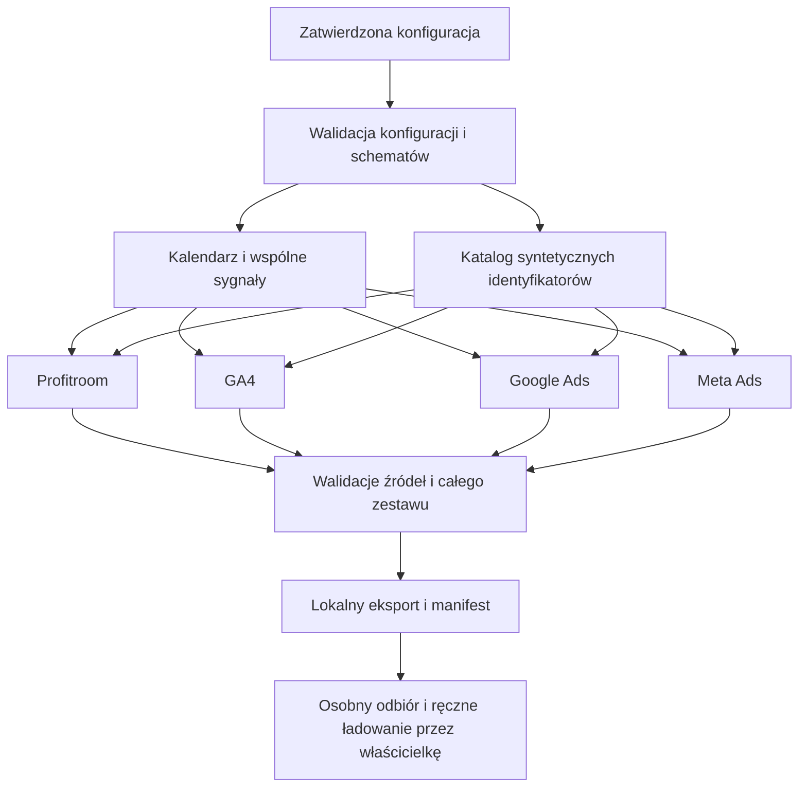

# Architektura generatora danych syntetycznych v1

Status: **0.1 — zaakceptowana architektura lokalnego generatora danych syntetycznych v1**.

Podstawa: [scenariusz 0.3](SYNTHETIC_DATA_SCENARIO.md), [kontrakt 0.2](ANALYTICS_CONTRACT.md), [projekt BigQuery](BIGQUERY_DESIGN.md) oraz zaakceptowane [DDL GA4](../bigquery/ddl/001_create_ga4_events_demo.sql), [Meta](../bigquery/ddl/002_create_meta_daily_campaign_stats_demo.sql), [Google](../bigquery/ddl/003_create_google_daily_campaign_stats_demo.sql), [Profitroom](../bigquery/ddl/004_create_profitroom_reservations_demo.sql).

**USTALONE** oznacza wymaganie istniejącego scenariusza, DDL lub bieżącego zadania. **PROPOZYCJA** oznacza rozwiązanie do akceptacji. **DO DECYZJI** wskazuje brakujące ustalenie. Dokument stanowi projekt, a nie implementację ani zgodę na ładowanie danych.

## 1. Cel, zakres i pierwszeństwo ustaleń

Generator lokalny tworzy cztery odrębne źródła syntetyczne dla Hotel Baltic Horizon Demo (`hotel_demo_001`), w PLN, Europe/Warsaw, przez dokładnie 90 kolejnych lokalnych dni. Wspólne czynniki popytu nadają im podobny kontekst; każdy raport zachowuje własną jednostkę i zakres obserwacji. Meta i Google pokazują wyniki platformowe, GA4 zachowanie i lejek, Profitroom rezerwacje, kanał, wartość i anulację.

Przy tej samej pełnej konfiguracji, seedzie i wersji algorytmu wynik jest identyczny bajtowo. Zmiana seeda zmienia rozkłady, czasy i identyfikatory rekordów, zachowując zatwierdzone ograniczenia i tolerancje kalibracji. Sam seed bez konfiguracji i wersji nie definiuje kompletnego wyniku.

Projekt obejmuje generowanie, walidację i przyszły lokalny eksport. Linkowanie GA4–Profitroom, KPI aktywnych rezerwacji, linked bookings, linked ROAS, hma_core, hma_app oraz AI pozostają osobnymi etapami. Generator korzysta z konfiguracji lokalnej; konfiguracja aplikacji i progi hotelu nadal należą do Supabase.

### 1.1. Rozbieżności dokumentacyjne wymagające jawnego traktowania

- Aktualne fizyczne cele to `ga4.events_demo`, `meta_ads.daily_campaign_stats_demo`, `google_ads.daily_campaign_stats_demo`, `profitroom.reservations_demo`. Starsze nazwy i rewizje w projekcie BigQuery oraz sekcji 2 scenariusza nie są schematem wyjściowym generatora. Profitroom po doprecyzowaniu właścicielki odwzorowuje 13 nullable pól rzeczywistego źródła; lokalny DDL zastępuje wcześniejszy model 22 pól, bez wykonania zmiany w chmurze.
- Aktualne liczebności pochodzą z sekcji 3.1–5 scenariusza 0.3. Historyczne 116015 eventów, 18000 sesji, 600 rezerwacji i pokrycia ze starszego projektu nie są celami generatora.
- **G01 — ZAAKCEPTOWANE:** generator korzysta z jednego wspólnego start_date w konfiguracji oraz dokładnie 90 kolejnych dni dla wszystkich źródeł. Konkretny start_date zostanie ustalony przy konfiguracji implementacji. Wcześniejsze daty w scenariuszu pozostają zapisem tego dokumentu; niniejsza późniejsza decyzja nie przenosi ich automatycznie do konfiguracji generatora i nie zmienia dokumentu scenariusza.
- W źródłowym `Kanał rezerwacji` demo używa wartości Booking.com, Expedia i Booking Engine. Kody canonical, w tym direct_web, należą do przyszłego adaptera. `Data anulacji IS NULL` oznacza brak informacji o anulowaniu, a nie potwierdzenie aktywnego statusu.

Pozostałe ustalenia zachowują zakres. Rozbieżności nie blokują projektu architektury; decyzje potrzebne konkretnemu generatorowi są bramką przed jego uruchomieniem.

## 2. Wspólna konfiguracja i wynik

**PROPOZYCJA:** wersjonowany plik `bigquery/generator/config/scenario-v1.json`, bez danych referencyjnych na poziomie rekordów i bez sekretów. Plik powstanie dopiero przy implementacji.

| Pole / grupa | Znaczenie |
|---|---|
| scenario_id / scenario_version | `baltic_horizon_2026_v1` / `0.3`; zmiana akceptowanego scenariusza wymaga osobnej decyzji |
| seed | `20260601` jako bazowe ziarno; inne ziarna do testów |
| start_date / days | G01 zaakceptowane: wspólna data do ustalenia przy konfiguracji implementacji, niezależna od zegara systemowego; `days=90`; end_date = start_date + 89 dni |
| hotel_id / stream_id | `hotel_demo_001` / `demo_web_001`; stała tożsamość obiektu i strumienia, również przy zmianie seeda |
| currency_code / timezone / platform | PLN / Europe/Warsaw / WEB |
| contract_version | `0.2` |
| generator_versions | Wersja wspólnego algorytmu i każdego źródła; GA4 zachowuje nazwę `ga4-demo-generator-v1`; pozostałe proponowane jako `<source>-demo-generator-v1` |
| config_revision / schema_hashes | Wersja technicznych parametrów i skróty czterech DDL; rozdzielone od wersji scenariusza |
| targets | G02 zaakceptowane: orientacyjny cel kalibracyjny ze scenariusza, jednostka i reguła tolerancji; bez wymogu dokładnego trafienia w cel |
| channel_mix / device_mix / privacy_policy | Uzgodnione rozkłady; brakujące części pozostają nierozstrzygnięte |
| campaigns / attribution_policies | Wspólny katalog syntetycznych kampanii, aktywność i polityki per działanie |
| variability / allocation | Parametry szumu, sezonowości, pików, ograniczeń i rozdziału reszt |
| clock_policy | G01 zaakceptowane: czasy źródłowe, as_of_at, loaded_at i batch_id deterministyczne względem konfiguracji scenariusza i seeda; bez NOW() i bieżącego zegara |
| missing_data_policy | Jawne maskowanie, NULL, dostępność działań i opcjonalnych parametrów |

**G01 — ZAAKCEPTOWANE:** ten sam seed i ta sama konfiguracja czasu dają identyczne wartości czasowe. start_date pochodzi wyłącznie z konfiguracji; generator nie używa NOW(), bieżącej daty ani niedeterministycznego czasu do tworzenia danych. Brak wybranej daty oznacza konieczność jej uzupełnienia przed uruchomieniem, a nie zmianę wymogu 90 dni.

Walidator konfiguracji zatrzymuje generowanie zależnego źródła przy brakującej decyzji. Pole nieustalone nie jest automatycznie zerem.

**PROPOZYCJA wyniku:** pliki NDJSON per źródło i dzień, lokalny manifest całego zestawu oraz raport walidacji. Manifest opisuje 90 dni, także z zerem rekordów, wersje, seed, skrót konfiguracji, sumy, liczby NULL i SHA-256 plików. Jest lokalnym opisem artefaktu, a nie tabelą operacyjną ani historią uruchomień w BigQuery. Eksport i manifest powstaną dopiero później.

## 3. Struktura i kolejność generowania

**PROPOZYCJA:** niezależne narzędzie Node.js w stylu ESM, poza `prototype`, zgodnie z istniejącym kierunkiem Node 24 projektu. Konkretna wersja runtime i danych stref czasowych zostanie przypięta przy implementacji. Podstawowy generator używa funkcji czystych; nie wymaga SDK chmurowego.



Kolejność robocza: konfiguracja → kalendarz/sygnały/katalog → Profitroom → GA4 → Google Ads → Meta Ads → walidacja → eksport. Profitroom jako pierwszy pozwala sprawdzić prosty bilans rezerwacji. Nie jest jednak wejściem rekordowym GA4. Każde źródło odczytuje wspólne sygnały i własną konfigurację, a nie zakupy innego źródła. Zmiana kolejności uruchomienia modułów nie zmienia wyniku.

Współdzielone są hotel, czas, waluta, katalog kampanii i zagregowane sygnały. Oddzielne są losowania konwersji, rezerwacji, wartości oraz obserwacji pomiarowych. Nie powstaje wspólna lista osób ani uniwersalna lista zakupów przez cztery platformy.

## 4. Wewnętrzne sygnały i model zmienności

**PROPOZYCJA:** dla dnia d i metryki m powstaje dodatnia waga:

`w[d,m] = active[d,m] × clamp(exp(trend[d] + weekday[d,m] + season[d] + a[m] × demand[d] + b[m] × pressure[d] + noise[d,m] + peaks[d,m]), lower[m], upper[m])`.

- Trend: łagodna funkcja liniowa lub odcinkowa w obrębie 90 dni.
- Weekday/weekend: siedem jawnych współczynników o średniej logarytmicznej zero. Weekend jest częścią tych współczynników, dzięki czemu wpływ nie jest liczony dwa razy.
- Sezonowość: gładka krzywa zgodna z zatwierdzonym oknem i profilem hotelu. Zmiana zakresu poza lato wymaga ponownego dopasowania profilu.
- Popyt: wspólny ograniczony proces `demand[d]=clip(rho*demand[d-1]+innovation[d], -cap, cap)`, początek ustalony deterministycznie.
- Presja kampanii: funkcja planu aktywności, wspólna z GA4 na poziomie tendencji, bez równania kliknięć i sesji.
- Szum: osobne, centrowane i ograniczone losowania dla źródeł, metryk i kampanii. Parametr rho spełnia `0 <= rho < 1`.
- Piki: kilka syntetycznych łagodnych impulsów o ograniczonej wysokości i szerokości; ich daty wynikają z seeda, zamiast z kalendarza referencji.
- `active=0` wyłącza emisję dla kosztu i delivery. Dopuszczalność raportowania konwersji ma osobną maskę zgodną z polityką G06. `lower`, `upper`, amplitudy, liczba pików i rho są wersjonowanymi parametrami implementacji w ramach G07.

Dodatkowe wewnętrzne sygnały opisują mobile, intensywność direct/organic/paid, skłonność do rozpoczęcia ścieżki i anulacji. Czynniki te wpływają na wagi, a orientacyjne cele i tolerancje służą ocenie wyniku końcowego. Same sygnały nie trafiają do żadnej kolumny źródłowej.

Ograniczenia amplitud zapobiegają przypadkowym ekstremom. Niezależny szum metryk i rzadkie zdarzenia z zerami zapobiegają idealnym lejkom. Powtarzające się zera są naturalne; test różnorodności dotyczy całych profili dni o dużym wolumenie, nie wymaga 90 różnych wartości dla rzadkiego zakupu. Minimalne wymagania zmienności nie są twardą kopią min/max referencji.

## 5. GA4 — generowanie obserwacji

Cele orientacyjne pozostają dokładnie zgodne ze scenariuszem:

| Event | Cel 90 dni, około |
|---|---:|
| session_start | 92 123 |
| page_view | 230 810 |
| user_engagement | 124 773 |
| step1_dates_and_rooms | 36 207 |
| step2_extras | 1 940 |
| step3_confirmation | 513 |
| purchase | 80 |
| click_tel | 590 |
| form_submit | 237 |
| open_apartment_details | 13 537 |
| open_package_details | 6 053 |
| engaged_view / click_mail | Bez targetu zgodnie z G03; ewentualne generowanie wymaga osobnego uzgodnienia |

Suma jedenastu podanych zaokrąglonych celów wynosi **506863**, a nie pełna zaakceptowana suma 13 typów. G02 zatwierdza orientacyjny charakter tych celów, bez wymuszania sumy 506863. **G03 — ZAAKCEPTOWANE:** engaged_view i click_mail pozostają bez sztywnego targetu; generator nie wyprowadza go w celu wypełnienia szablonów sesji. Ich ewentualne późniejsze generowanie wymaga osobnego uzgodnienia. Brak kalibracji nie jest zmierzonym zerem.

### 5.1. G03 — zaakceptowany prosty model sesyjny

**G03 — ZAAKCEPTOWANE:** podstawą generatora jest sesja, a nie pełny model osoby lub customer journey. Celem jest realistyczny zbiór zróżnicowanych sesji, poprawne agregaty i spójne timestampy przy niewielkiej złożoności. Powstają wyłącznie nowe syntetyczne identyfikatory i zachowania, bez kopiowania prawdziwych użytkowników.

Identyfikatory przeglądarek/urządzeń służą strukturze GA4. W obecnym DDL jest to user_pseudo_id; decyzja nie dodaje kolumny user_id. Generator nie odtwarza pełnej historii osoby przez 90 dni ani cyfrowego bliźniaka. Ewentualne powroty korzystają z prostego, ograniczonego mechanizmu syntetycznego, bez wymuszania ścisłej relacji między sesjami jednej osoby. Techniczne parametry liczby identyfikatorów i częstości powrotów pozostają do konfiguracji implementacji; G03 nie nadaje im nowych targetów.

Sesja wewnętrzna ma własny klucz roboczy, zdarzenie rozpoczęcia, czas i zestaw obserwacji. `ga_session_id` jest INT64 zapisanym w event_params, a połączenie sesji eksportowanej wymaga hotel_id, stream_id i dostępnego user_pseudo_id. Wewnętrzny klucz sesji nie zastępuje brakującego identyfikatora w źródle. Politykę zgód i maskowania określa zaakceptowane G04 w sekcji 5.3.

Mobile stanowi orientacyjnie około **87,45% sesji**, z tolerancją według G02. Pozostałe urządzenia wypełniają pozostałą część ruchu, bez narzucania nowego dokładnego podziału. Rozkład dni jest syntetyczny; generator nie kopiuje rzeczywistego dziennego rozkładu urządzeń.

Orientacyjne udziały kanałów w sesjach pozostają następujące: Paid Social 35,01%, Paid Search 14,67%, Organic Search 13,67%, Referral 11,14%, Unassigned 11,04%, Organic Social 6,94%, Direct 6,21%. Znane udziały sumują się do **98,68%**. Pozostałe **1,32 p.p.** stanowi elastyczną techniczną pulę generatora `other / pozostałe`, bez deklaracji dodatkowej wiedzy referencyjnej. Generator nie dopisuje tej reszty do jednego istniejącego kanału i nie normalizuje automatycznie znanych udziałów do 100%. Pula other nie jest nową potwierdzoną kategorią referencyjną; szczegółowe mapowanie eksportowe pozostaje parametrem implementacji.

Pierwsze źródło w traffic_source pozostaje odrębne od źródła sesji w session_traffic_source_last_click. To rozróżnienie nie wymaga pełnej historii osoby. Proste powroty mogą obejmować Meta → Brand lub Direct, bez zatwierdzania ich liczebności czy docelowego modelu journey. Kontraktowe okno 30 dni pozostaje zasadą późniejszej analizy obserwowanych ścieżek, a nie obowiązkiem budowy pełnego customer journey w generatorze v1. Direct, Organic i Unassigned zachowują odrębność. Role Brand/Generic/GHA są zaakceptowane w G06; techniczne mapowanie do pól GA4 zostanie jawnie zapisane w konfiguracji implementacji.

### 5.2. G03 — archetypy sesji, zdarzenia i czas

**G03 — ZAAKCEPTOWANE:** generator korzysta z kilku prostych archetypów:

- krótka sesja informacyjna;
- przeglądanie szczegółów apartamentu;
- przeglądanie pakietu lub oferty;
- wejście do silnika rezerwacyjnego: step1_dates_and_rooms;
- wejście głębiej w proces: step2_extras, step3_confirmation;
- sesja z purchase;
- sesja kontaktowa: click_tel, form_submit;
- realistyczne kombinacje powyższych zachowań.

Są to archetypy generowania, a nie sztywne ścieżki każdej sesji. Generator nie wymusza na wszystkich sesjach sekwencji step1 → step2 → step3 → purchase. Referencyjne 39,30% / 5,36% / 26,46% / 15,58% są ilorazami liczników zdarzeń w agregacie, a nie dowodem przejścia tych samych osób lub sesji. Model zachowuje realistyczną strukturę agregatów bez sztucznie idealnego lejka sesyjnego. Zdarzenia, które tworzą sekwencję w konkretnej sesji, mają spójną kolejność czasową.

`page_view`, `user_engagement` i otwarcia szczegółów mogą powtarzać się w sesji. **user_engagement może wystąpić wielokrotnie; nie obowiązuje 1 session = 1 user_engagement.** Kontakty click_tel i form_submit są osobną gałęzią zachowania, a nie rezerwacją. engaged_view i click_mail nie służą do sztucznego uzupełniania archetypów.

Czas rozpoczęcia wynika z syntetycznego rozkładu godzinowego, odstępy zdarzeń są dodatnie i ograniczone. Przy sesjach przez północ przydział odbywa się z uwzględnieniem budżetów dni docelowych. Przekroczenie końca okna kończy obserwację; nie dopisuje dnia 91. `event_timestamp` to całkowite mikrosekundy UTC, `metric_date` i event_date wyprowadzane są w Europe/Warsaw. W eksporcie INT64 nie przechodzi przez niedokładne operacje zmiennoprzecinkowe. G03 zatwierdza prosty model sesyjny, a G07 określa zasady algorytmu i walidacji końcowego wyniku.

### 5.3. G04 — zaakceptowane zgody, braki i końcowe obserwacje

**G04 — ZAAKCEPTOWANE:** v1 stosuje prosty model pełnego lub ograniczonego pomiaru, bez odwzorowywania pełnego Consent Mode i wszystkich mechanizmów zgód Google. Wartości privacy_info i udział wariantów zostaną jawnie zapisane w konfiguracji implementacji; ta decyzja nie ustala nowych liczebności.

Brak danych oznacza NULL, a 0 oznacza zmierzone zero. Event może istnieć przy niepełnym user_pseudo_id lub identyfikatorze sesji. Maskowanie identyfikatorów jest oddzielone od usuwania zdarzeń: brak identyfikatora nie usuwa automatycznie eventu. Brakujące opcjonalne parametry mogą być pominięte zgodnie ze strukturą event_params; wymagane pola DDL pozostają wypełnione. NULL jest zachowywane tam, gdzie dopuszcza je schemat.

Takich eventów nie łączymy przez demo_event_id, raw_row_id ani wewnętrzną wiedzę generatora. Brak identyfikatorów nie tworzy sztucznego powiązania z Profitroom. Liczba sesji roboczych jest odrębna od sesji odtwarzalnych z eksportu; raport pokazuje ograniczenia pomiaru.

Każdy klucz event_params występuje raz i ma jeden nośnik wartości. Parametry obejmują wyłącznie uzgodnione pola DDL, np. ga_session_id, engagement_time_msec, session_engaged, currency i syntetyczne adresy .example. Zgodność katalogu kampanii nie oznacza powiązania z rezerwacją.

Bez wiarygodnego pomiaru purchase_revenue pozostaje NULL. Generator nie tworzy transaction_id tylko po to, aby każde purchase wyglądało na kompletne; brak tożsamości transakcji pozostaje jawny. Nie kopiuje kwot Profitroom ani nie zakłada relacji około 80 purchase do około 37 Booking Engine. Model linkowania pozostaje odroczony.

**Targety GA4 dotyczą końcowego eksportowanego zbioru po wszystkich ograniczeniach i maskowaniu.** Braki identyfikatorów nie mogą obniżyć końcowych liczników poza tolerancję G02. Walidacja działa po ograniczeniu do okna i finalnej reprezentacji obserwacji. Generator nie dopisuje sztucznych eventów ostatniego dnia do domknięcia sum; wynik poza tolerancją podlega G07.

## 6. Profitroom — source schema 1:1

**USTALONE: source schema ≠ canonical schema.** `profitroom.reservations_demo` ma dokładnie te same 13 pól, typy, nullable i kolejność co rzeczywista tabela źródłowa wskazana przez właścicielkę. Różni się wyłącznie syntetyczną zawartością. Pełny schemat zawiera DDL `004_create_profitroom_reservations_demo.sql`.

Przepływ docelowy: source Profitroom → adapter / canonical reservations → hma_core → hma_app. Adapter, canonical i dalsze warstwy pozostają poza implementacją generatora.

Cele pozostają orientacyjne: około 277 rekordów, 47 z datą anulacji, 230 bez informacji o anulowaniu, około 37 Booking Engine i około 573062 PLN wartości rekordów bez daty anulacji. Określenie „nieanulowane” w kalibracji oznacza ten ostatni podzbiór, a nie confirmed/completed/active.

**G05 — model danych źródłowych:**

1. Rozłożyć utworzenia na 90 dni przy wspólnym sygnale i niezależnym szumie; dzień bez rekordu jest poprawny.
2. Wypełnić `Kanał rezerwacji` wartościami Booking.com, Expedia, Booking Engine. To słownik demo, nie ograniczenie SQL. Anulowanie jest reprezentowane wyłącznie przez `Data anulacji`; NULL oznacza brak informacji o anulowaniu.
3. `Data przyjazdu` i `Data wyjazdu` wyznaczają długość pobytu. Generator v1 stosuje wyprzedzenie 1–90 dni, pobyty 2–5 nocy i 1–2 pokoje. Są to parametry danych demo, nie reguły struktury źródła. Pobyty mogą wykraczać poza okno. Liczba gości nie jest kolumną źródła.
4. `Oferta` i `Typ pokoju` pochodzą z małych, całkowicie syntetycznych słowników. `Wartość` zależy od typu, liczby pokoi i nocy. Korekta poza tolerancją jest proporcjonalna, ograniczona współczynnikiem 0,8–1,2; wynik w tolerancji pozostaje bez korekty.
5. `Zapłacono` i `Pozostało do zapłaty` są przydzielane po korekcie wartości. Obliczenia w groszach zachowują dokładne Zapłacono + Pozostało do zapłaty = Wartość; eksport używa liczb FLOAT64 zgodnie ze źródłem. W demo są rezerwacje bez wpłaty, z zaliczką i opłacone. Dla anulowanych wartość jest zachowana, wpłata może być zerowa lub częściowa; to syntetyczny stan płatności, nie księga zwrotów ani dowód wymagalnej należności.
6. `Kod rezerwacji` jest syntetyczny i unikalny w zestawie. Wszystkie 13 pól źródła dopuszczają NULL; bazowy generator wypełnia pozostałe pola poza datą anulacji. Walidacja schematu nullable jest oddzielona od kompletności bazowego demo.

**G01:** `Data rezerwacji` należy do wspólnego okna, w Europe/Warsaw. Dzień raportowy i długość pobytu są wyliczane w pamięci. Stan scenariusza i czas eksportu są deterministyczne i opisane wyłącznie w manifeście. Hotel, scenario_id, wersje i inne metadane techniczne pozostają poza rekordami źródłowymi. Tabela nie zawiera metric_date, is_cancelled, statusów, pól linkage ani historii rewizji. Znana data anulacji mieści się między utworzeniem a momentem stanu scenariusza, nie później niż syntetyczny początek pobytu.

## 7. Google Ads

**G06 — ZAAKCEPTOWANE:** trzy syntetyczne kampanie — po jednej Search Generic, Brand i GHA, jeden syntetyczny customer_id. Nowe nazwy opisują ofertę fikcyjnego hotelu. Katalog zachowuje ustalone ID Brand i Generic, nowe ID GHA będzie syntetyczne i deterministyczne, zapisane w konfiguracji implementacji. Nazwy i identyfikatory rzeczywistych kampanii pozostają poza generowanymi danymi. Alternatywne kampanie historycznej referencji nie stają się dwiema równoległymi kopiami kosztu.

Plan aktywności jest oddzielny od campaign_status na as_of_at. Propozycja bazowa: kampanie dostępne w całym oknie, z konfigurowalnymi przerwami emisji jako parametrem implementacji. Każda ma wiersz na każdy dzień (270 wierszy przy trzech kampaniach); brak emisji to znany zerowy koszt i delivery. Działania atrybucyjne w takim dniu zależą od polityki dat, a nie automatycznie od zera kosztu.

Cele orientacyjne: cost 24074 PLN, impressions 220693, clicks 11370, step1 4411, step2 234, step3 63, purchases 10, purchase_value 53707 PLN. Zgodnie z zaakceptowanym G02 są to punkty odniesienia dla tolerancji, a nie wymagane dokładne sumy. Precyzja reprezentacji kredytów pozostaje do doprecyzowania w otwartych decyzjach technicznych.

Koszt rozdzielany jest na role 60/35/5, następnie na dni. Wyświetlenia i kliknięcia korzystają z osobnych profili grup, inspirowanych proporcjami referencji. Konwersje każdej akcji otrzymują własne wagi i opóźnienia raportowania. Kredyty konwersji są NUMERIC, np. w uzgodnionej siatce 0,01 jednostki, odrębnej od groszy. Dzienne nierówności step1 >= step2 >= step3 >= purchases nie są walidacją.

phone_contacts (Telefon) i calls_from_ads mają oddzielne pule. Referencja Brand 8 i 2 nie jest pełnym wynikiem wszystkich grup; brak podstawy do generowania danego działania oznacza NULL zgodnie z G06. Brakujące dane w innych rolach pozostają NULL, zamiast zer lub samodzielnie ekstrapolowanych celów.

**G06 — ZAAKCEPTOWANE:** prosta, jawna i deterministyczna polityka raportowania, bez rozbudowanego symulatora atrybucji lub aukcji. Model, okno, podstawa daty i attribution_policy_id są zapisywane jawnie w konfiguracji; nieznane metadane pozostają NULL zgodnie z DDL, zamiast sugerować znajomość rzeczywistej polityki. Wspólne pola opisują wszystkie akcje tylko przy zgodnej polityce; różne modele/okna otrzymują specyfikację per akcja i NULL w polu wspólnym zgodnie z DDL. Polityka jest lokalną konfiguracją, bez nowej tabeli. purchase_value jest wartością tej samej platformowej akcji co purchases, odrębną od Profitroom.

## 8. Meta Ads

**G06 — ZAAKCEPTOWANE:** dwie podstawowe syntetyczne kampanie prospecting i remarketing z ustalonymi ID i własnymi nazwami. Jeden account_id, jedna wersja dnia kampanii, docelowo 180 wierszy przy pełnym pokryciu. Udział budżetu ról i przerwy emisji są parametrami implementacji; historyczny podział 75/25 nie jest automatycznie przywracany. Przyjęte role nie ograniczają DDL do prospecting i remarketing w przyszłości.

| Metryka | Orientacyjny cel 90 dni |
|---|---:|
| spend | 30951,36 PLN |
| impressions | 1843578 |
| clicks | 98442 |
| link_clicks | 36576 |
| landing_page_views | 32796 |
| search_events | 16902 |
| add_to_cart | 450 |
| initiate_checkout | 72 |
| purchases | 18 |
| purchase_value | 28008 PLN |

Delivery i kliknięcia korzystają z wag dziennych i różnic ról. Rozdział z ograniczeniami zachowuje link_clicks <= clicks i landing_page_views <= link_clicks jako kontrolowaną cechę syntetycznego zestawu, a nie uniwersalny dowód poprawności realnego pomiaru. Dalsze akcje mają osobne pule kredytów i zera w wielu dniach. Purchases nie musi być mniejsze od initiate_checkout danego dnia.

Każda kolumna ma jedną akcję kanoniczną z DDL: link_click, landing_page_view, offsite_conversion.fb_pixel_search, fb_pixel_add_to_cart, fb_pixel_initiate_checkout i fb_pixel_purchase (ostatnie trzy również z prefiksem offsite_conversion). ActionValues zakupu trafia tylko do purchase_value; aliasy nie tworzą dodatkowych liczników. Obowiązuje prosta jawna polityka G06; parametry modelu, okna, podstawy daty i precyzji kredytów będą zapisane w konfiguracji. Koszt występuje raz w wierszu, niezależnie od liczby akcji.

### 8.1. G06 — wspólny przydział purchases i purchase_value dla reklam

**ZAAKCEPTOWANE dla Google Ads i Meta Ads:** purchases i purchase_value mają wspólny mechanizm przydziału. Najpierw ustalany jest kredyt purchases w komórkach dzień × kampania. Wartość może trafić wyłącznie do komórki z dodatnim kredytem dla tej samej kanonicznej akcji i zgodnej polityki raportowania. Korekty i zaokrąglenia zachowują ten warunek.

Przy zmierzonym purchases=0 dodatnia purchase_value jest błędem. NULL oznacza brak pomiaru, a nie zero i nie uprawnia do przydzielenia dodatniej wartości. Dodatni kredyt purchases nie wymusza sztucznej wartości, jeśli pomiar wartości jest niedostępny — wtedy pozostaje NULL. Wyniki obu platform pozostają odrębne od wartości Profitroom.

Konwersje mogą być ułamkowe zgodnie z DDL. Nie obowiązuje dzienny wymóg step1 >= step2 >= step3 >= purchase. Wspólny przydział wartości i kredytu zakupu nie tworzy modelu linkowania między źródłami.

## 9. G07 — deterministyczność, identyfikatory i eksport

**G07 — ZAAKCEPTOWANE:** jeden wersjonowany deterministyczny mechanizm wag i seedowanego losowania, przypięta wersja runtime, deterministyczne sortowanie i seedowane ID, bez nieseedowanych UUID ani zależności od zegara systemowego. Lokalny eksport v1 może korzystać z NDJSON i manifestu z hashami.

**Szczegół techniczny do zapisania przy implementacji:** proponowane losowanie indeksowane, a nie jeden globalny strumień. Wartość losowa wynika z wersjonowanego SHA-256 kanonicznego zestawu `(seed, scenario_id, config_revision, source, metric, day, entity, draw_index)`. Ściśle określony fragment bitów mapowany jest na przedział [0,1); stała kolejność pól i kodowanie UTF-8 są częścią algorytmu. Dzięki temu dodanie metryki w Meta nie przesuwa losowań GA4. Transformacje, zaokrąglenia i runtime są wersjonowane.

- Hotel, stream i ustalone konta/kampanie zachowują ID z konfiguracji; są deterministyczne jako stałe scenariusza. Nowe ID GHA i nazwy powstają syntetycznie zgodnie z G06.
- Reservation, browser, event i raw_row otrzymują prefiks demo oraz skrót przestrzeni seed/scenario/source i stabilny indeks. Walidator sprawdza kolizje. Zmiana seeda zmienia rekordowe ID, a nie tożsamość hotelu.
- ga_session_id ma bezpieczny zakres INT64 i jednoznaczność w kluczu z urządzeniem; nie tworzymy nieseedowanych UUID.
- batch_id, tam gdzie występuje w DDL, zawiera scenario, źródło, dzień i skrót wersji. Profitroom source nie otrzymuje batch_id; identyfikowalność pliku zapewnia manifest i jego hash.
- Sortowanie: GA4 po metric_date, event_timestamp, demo_event_id; reklamy po kluczu logicznym; Profitroom po lokalnym dniu Data rezerwacji i Kod rezerwacji w obrębie hotelu wskazanego w manifeście; kolejność 13 pól NDJSON odpowiada ordinal positions źródła. Pola JSON i tablice event_params mają stałą kolejność.
- Kwoty są całkowitymi groszami podczas obliczeń; NUMERIC eksportowane jako dokładne reprezentacje dziesiętne. INT64 i timestampy mają jawny format. Profitroom eksportuje kwoty jako FLOAT64 po obliczeniach w groszach; brak równości binarnej FLOAT64 nie zmienia kontroli groszowej. GA4 FLOAT64 dla kwoty używane dopiero po ewentualnej akceptacji generowania wartości.
- GA4 nie ma kolumn contract_version/scenario_version ani as_of_at: te informacje trafiają do manifestu. Nie dodajemy pól spoza DDL. ingest_date jest datą UTC loaded_at.

Proponowany NDJSON zachowuje zagnieżdżone STRUCT/ARRAY GA4. Serializator ma ścisłą listę dozwolonych pól na podstawie DDL. Lokalne logi czasu wykonania, ścieżki absolutne i timestamp bieżący pozostają poza deterministycznym manifestem.

## 10. G02 — orientacyjne targety i precyzja

**G02 — ZAAKCEPTOWANE:** cele z SYNTHETIC_DATA_SCENARIO.md są orientacyjnymi celami kalibracyjnymi. Generator zachowuje skalę, proporcje, realistyczne relacje i naturalną zmienność dzienną. Wartości takie jak 92123 session_start, około 30951 PLN Meta, 24074 PLN Google lub 277 rezerwacji nie wymagają trafienia co do sztuki lub grosza. Referencje i cele w scenariuszu pozostają bez zmian; mnożniki referencyjne to dokładne 10/3 i 18.

Generator najpierw tworzy naturalny wynik, następnie ocenia go względem tolerancji. Wynik mieszczący się w zaakceptowanej tolerancji pozostaje bez dalszej sztucznej korekty. Tolerancje są regułami walidacji jakości, a nie poleceniem wyrównania ostatniego dnia lub pojedynczego rekordu. Wynik poza tolerancją wymaga raportu jakości i ograniczonej korekty zgodnie z zaakceptowanym G07 w sekcji 10.3.

### 10.1. Proponowana prosta reguła tolerancji v1

Poniższe zakresy są propozycją operacyjną zgodną z zaakceptowanym kierunkiem G02. G04–G07 są zaakceptowane na poziomie zasad. Szczegółowe wyjątki i limity bezwzględne wymagają jawnego zapisania w konfiguracji implementacji, bez ukrytej zmiany tolerancji G02.

| Kontrola | Proponowana reguła jakości |
|---|---|
| Główne wolumeny i koszty | Orientacyjnie około ±2% względem celu okresowego |
| Udziały i proporcje, w tym mobile, kanały i mix Google 60/35/5 | Orientacyjnie około ±2 punktów procentowych; węższy zakres, jeśli wymaga go konkretna metryka, ustalany jawnie |
| Anulowane, nieanulowane, Booking Engine i inne małe liczebności | Także kontrola bezwzględnego odchylenia i sensowności bilansu; konkretnych limitów nie ustalamy w tej aktualizacji |
| Kwoty | Nieujemne, obliczane w groszach, spójne z rozkładem rezerwacji lub kampanii; tolerancja celu nie oznacza niedokładnej arytmetyki |
| Kredyty konwersji NUMERIC | Dopuszczalne ułamki; ocena skali z uwzględnieniem małych liczebności, bez wymogu dokładnej sumy targetu; siatka precyzji nadal otwarta |
| engaged_view i click_mail | Nadal bez targetów i bez arbitralnego zera jako wyniku kalibracji |

### 10.2. Dokładność wewnętrzna a tolerancja kalibracji

Liczby eventów i rezerwacji pozostają całkowite. Wygenerowane nieanulowane + anulowane muszą dokładnie równać się liczbie wszystkich wygenerowanych rezerwacji, choć ta liczba może różnić się od orientacyjnych 277. Podobnie suma kosztów kampanii musi dokładnie odpowiadać sumie źródła obliczonej z tych rekordów, a nie obowiązkowo celowi referencyjnemu.

±2% oznacza względne odchylenie od celu; ±2 p.p. oznacza różnicę udziałów. Przedziały nie uzasadniają zmiany jednostek, ujemnych wartości, podwójnego kosztu ani dopisywania nieznanych kanałów. Zaakceptowane 0,01 PLN różnicy referencji Google pozostaje zaokrągleniem referencji, nie zgodą na niespójną arytmetykę wygenerowanego zestawu.

### 10.3. G07 — zaakceptowany proces i warunki brzegowe

1. Zbudować naturalne wagi i zmienność za pomocą jednego deterministycznego mechanizmu.
2. Wygenerować wynik w dozwolonych komórkach i sprawdzić końcowe tolerancje G02.
3. Wynik w tolerancji pozostawić bez korekty. Korygować wyłącznie wynik poza tolerancją, zachowując realizm i ograniczenia źródła.
4. Rozdzielać korektę między dozwolone komórki, zamiast kierować całą resztę do ostatniego dnia lub pojedynczego rekordu. Brak wykonalnej korekty oznacza błąd i raport, a nie zmianę celu lub zasad.
5. Po korekcie i zaokrągleniach ponownie zweryfikować końcowy eksport, w tym relację purchases/purchase_value.

**Obowiązkowe warunki:**

- Target=0 daje 0 we wszystkich dozwolonych, mierzonych komórkach. Nieznany target i brak pomiaru pozostają odrębne od zera; reguła nie zastępuje NULL ani nie wyznacza celu niekalibrowanym eventom.
- Dodatni target bez dozwolonych komórek oznacza błąd. Zerowa suma wag przy dodatnim targetcie również zatrzymuje przydział, zamiast dzielenia przez zero.
- Generator nie tworzy nowych rekordów wyłącznie w celu dopchnięcia targetu. Korekta korzysta z istniejącej dozwolonej struktury wyniku.
- Metoda największych reszt lub analogiczna procedura może rozdzielać wartości całkowite wyłącznie w dozwolonych komórkach, z kontrolą ograniczeń także po zaokrągleniu.
- Końcowe wartości są nieujemne, mają typy zgodne z DDL i spełniają ograniczenia logiczne źródła. Ograniczenie wag przed normalizacją nie zastępuje kontroli końcowych wartości.
- Maska emisji i dopuszczalność raportowania konwersji są osobne. Brak emisji nie otrzymuje kosztu; aktywna kampania nie musi raportować każdej konwersji.
- Kwoty reklam i Profitroom są nieujemne, obliczane w groszach i zaokrąglane deterministycznie; źródłowy eksport Profitroom ma FLOAT64, reklamy NUMERIC. GA4 zachowuje istniejący typ FLOAT64 dla opcjonalnej wartości, zgodnie z DDL i G04. Wynik w tolerancji nie wymaga trafienia w cel co do grosza.

Parametry algorytmu, dokładna wersja runtime i ustawienia serializacji będą jawnie zapisane przy implementacji. Akceptacja zasad G07 nie oznacza wykonania kodu ani testów powtarzalności.

## 11. Walidacje przed eksportem i ładowaniem

| Zakres | Obowiązkowe kontrole przyszłej implementacji |
|---|---|
| Konfiguracja | G01–G07 zaakceptowane; start_date i parametry implementacji jawnie uzupełnione w konfiguracji; 90 kolejnych lokalnych dni, wersje i skróty DDL; brak wartości historycznych jako celów |
| Schemat | Dokładne kolumny, typy, wymagane pola, struktury i tablice z DDL; brak dodatkowych pól; rozróżnienie NULL/0 |
| GA4 | Sumy eventów, pokrycie wszystkich dni, kolejność wybranego szablonu i budżety dni; wiele engagement dozwolone; mobile i kanały liczone na session_start; unikalne hotel_id/demo_event_id, parametry, mikrosekundy i projekcje dat; osobno urządzenia, sesje robocze i odtwarzalne |
| Profitroom | Ocena celów około 277/230/47, około 37 Booking Engine i wartości nieanulowanych w tolerancjach; dokładna spójność wewnętrznego bilansu; unikalność Kod rezerwacji w zestawie hotelu z manifestu; 13 pól source, zgodność dat i płatności w groszach; brak statusów i pól canonical |
| Google | Wszystkie cele bazowe i kredyty osobno, koszt raz na klucz metric_date/hotel/customer/campaign, sumy grup i mix 60/35/5, zgodność polityki i brak arbitralnych zer telefonów |
| Meta | Wszystkie cele bazowe, całkowite clicks/link/LPV, kanoniczne akcje, wartość osobno, unikalność metric_date/hotel/account/campaign; brak warunku purchases <= checkout |
| Czas | 90 dni zdarzeń/metryk, import po obserwacji; as_of_at <= loaded_at tam, gdzie pole istnieje; pobyty poza oknem dozwolone; pokrycie Profitroom z manifestu także dla dni bez rezerwacji |
| Cross-source | Wspólny scenario/hotel/strefa/waluta (GA4 currency w uzgodnionych parametrach i manifest), zgodne katalogi kampanii, rozłączne przestrzenie identyfikatorów zakupów/rezerwacji; brak mapy purchase–reservation |
| Syntetyczność | is_synthetic=true; ID wyłącznie z generatora/katalogu; URL tylko .example; brak wejścia z rekordami klientów; kontrola pochodzenia ważniejsza niż sam prefiks ID |
| Powtarzalność | Dwa uruchomienia tej samej konfiguracji mają identyczne SHA-256; inny seed zmienia rekordy i spełnia te same reguły tolerancji oraz spójności wewnętrznej; kolejność modułów i wielkość partii nie wpływają na wynik |
| Eksport | Ponowny odczyt lokalnych plików potwierdza typy, sumy, NULL, liczbę rekordów i hashe; walidacje niezależnie przeliczają wynik, zamiast tylko odczytywać cele konfiguracji |

Kompletność wygenerowanego pliku nie oznacza pełnego pomiaru użytkowników. Nieznane pokrycie pozostaje UNKNOWN w opisie jakości. Generator źródeł nie zapisuje metric_status/reason_codes w kolumnach, których DDL nie zawiera; raport lokalny ujawnia brakujące założenia i ograniczenia. Późniejsze reguły otrzymają własny projekt.

Testy ujemne walidatora mogą pracować w pamięci. Warianty awarii, drugi hotel i DST są oddzielnymi fixture w kolejnych zadaniach, poza sumami bazowego zestawu. Żadnego testu izolacji wielu hoteli nie uznaje się za zaliczony na jednym hotelu.

## 12. Idempotencja i przyszłe ręczne ładowanie

**PROPOZYCJA lokalna:** eksport do katalogu roboczego konkretnego skrótu konfiguracji, walidacja, następnie oznaczenie kompletnego pakietu. Ponowienie daje te same pliki i klucze, nigdy dopisanie do poprzedniej partii. Istniejący pakiet o tym samym skrócie, lecz innych bajtach jest błędem deterministyczności.

| Strategia późniejszego ładowania | Zalety | Ograniczenia |
|---|---|---|
| Pełne zastąpienie danych każdej z czterech dedykowanych tabel demo | Prosta, odporna na duplikaty także GA4; usuwa poprzedni seed i rekordy nieobecne w nowym pakiecie | Wymaga wyłącznego przeznaczenia tabel dla jednego zestawu i kontroli zachowania schematu/partycji; cztery tabele nie są jedną atomową publikacją |
| TRUNCATE tabeli, następnie load | Czytelna granica odtworzenia | Awaria między krokami pozostawia pustą tabelę; preferowane zastąpienie w jednym zadaniu zamiast osobnego kasowania |
| MERGE po kluczach logicznych | Przydatne później dla importów przyrostowych | Potrzebuje osobnego projektu ładowania, obsługi usuwania starych rekordów i partycji; sama aktualizacja/wstawianie zostawi rekordy poprzedniego seeda |
| Dopisywanie | Proste pojedyncze ładowanie | Nie jest strategią ponawiania całego demo: tworzy duplikaty |

**REKOMENDACJA do G08:** pełne zastąpienie danych czterech dedykowanych tabel, z zachowaniem DDL, wyłącznie gdy właścicielka potwierdzi zakres. Nie oznacza to kasowania datasetów. Przed uruchomieniem trzeba osobno sprawdzić dokładny mechanizm ładowania i jego zachowanie wobec metadanych tabel.

Manifest pełnego zestawu jest podstawą odbioru. Po częściowej awarii cały zestaw pozostaje nieodebrany; właścicielka ponawia brakujące ładowanie identycznym pakietem i weryfikuje wszystkie źródła. Aplikacja nie korzysta z takiej częściowej publikacji. Docelową atomową publikację agregatów rozstrzygnie O12 przed hma_core.

**USTALONE dla Etapu 4:** Codex przygotowuje dokumentację, przyszłe pliki i testy lokalne bez dostępu do Google Cloud. Operacje chmurowe wykonuje ręcznie właścicielka po wyjaśnieniu projektu, zasobów, skutku i kosztów. Kontrola obejmuje `hotel-marketing-analyzer-demo`, EU, cztery dokładne nazwy tabel, schematy, budżet/limity i plan odtworzenia. Alert budżetowy jest powiadomieniem, nie automatycznym twardym limitem. Ten dokument nie wykonuje ani nie autoryzuje uploadu.

## 13. Proponowana struktura przyszłych plików

Poniższe ścieżki są wyłącznie projektem; dziś powstaje tylko niniejszy dokument.

```text
bigquery/generator/
  README.md
  config/scenario-v1.json
  config/scenario-schema.json
  config/attribution-policies.json
  src/run.mjs
  src/shared/{random,calendar,signals,identifiers,allocation,money}.mjs
  src/sources/{ga4,meta-ads,google-ads,profitroom}.mjs
  src/validation/{config,schemas,source-totals,cross-source}.mjs
  src/export/{ndjson,manifest}.mjs
  tests/{allocation,determinism,schema,source-validation}.test.mjs
  instructions/manual-load.md
  output/<config-hash>/
```

Wyjście będzie lokalnym artefaktem wyłączonym z Git w przyszłej implementacji. Testy użyją wbudowanego runnera Node; ewentualne zależności wymagają uzasadnienia później. Warstwa eksportu nie posiada klienta Google Cloud. Instrukcja ręcznego ładowania pozostaje oddzielna od generatorów i konfiguracji scenariusza. `bigquery/analysis/` służy istniejącym analizom i pozostaje nietknięty.

## 14. Rejestr decyzji przed kodowaniem i dalsze etapy

| ID | Decyzja / rekomendacja | Termin i wpływ |
|---|---|---|
| G01 | **ZAAKCEPTOWANE:** wspólny start_date z konfiguracji, dokładnie 90 kolejnych dni, deterministyczny zegar i stan Profitroom; bez bieżącego czasu systemowego | Konkretny start_date i parametry czasu do zapisania przy konfiguracji implementacji; zasada została rozstrzygnięta |
| G02 | **ZAAKCEPTOWANE:** orientacyjne cele kalibracyjne, zachowanie skali i naturalności; wynik w tolerancji bez sztucznego dopasowania; dokładna arytmetyka wewnętrzna | Propozycja tolerancji v1 w sekcji 10; szczegółowe parametry wymagają jawnego zapisania przy implementacji |
| G03 | **ZAAKCEPTOWANE:** prosty model sesyjny i elastyczne archetypy, wielokrotne user_engagement, mobile około 87,45%, zachowane udziały kanałów z techniczną pulą other; engaged_view i click_mail bez targetów | Bez pełnego modelu osoby ani customer journey; parametry implementacyjne nie wprowadzają nowych celów; ewentualne generowanie niekalibrowanych eventów wymaga osobnego uzgodnienia |
| G04 | **ZAAKCEPTOWANE:** pełny/ograniczony pomiar, jawne NULL, maskowanie odrębne od usuwania eventów, targety końcowego eksportu GA4 | Bez pełnego Consent Mode i sztucznego transaction_id lub linkowania; sekcja 5.3 |
| G05 | **ZAAKCEPTOWANE:** prosty model kanału i obecności Data anulacji w źródle, realistyczne pobyty i kwoty, orientacyjne cele G02 | Bez statusów active/confirmed/completed, rewizji i linkowania; sekcja 6 |
| G06 | **ZAAKCEPTOWANE:** 3 kampanie Google, 2 podstawowe role Meta, prosta deterministyczna polityka i wspólny przydział purchases/purchase_value | Parametry zapisane przy implementacji, bez symulatora aukcji; sekcje 7–8.1 |
| G07 | **ZAAKCEPTOWANE:** deterministyczne wagi i losowanie, korekta tylko poza tolerancją, jawne warunki brzegowe i kontrola końcowego wyniku | Przypięty runtime, seedowane ID, sortowanie i opcjonalny NDJSON z manifestem; sekcje 9 i 10.3 |
| G08 | **OTWARTE / NIEBLOKUJĄCE DLA LOKALNEJ IMPLEMENTACJI:** tryb ręcznego zastąpienia danych i odbiór zestawu | Wymaga osobnej decyzji przed ładowaniem; rekomendacja z sekcji 12 nie jest akceptacją |

Celowo odroczone: finalne linkowanie GA4–Profitroom i jego wartości/pokrycia, statusy aktywnych rezerwacji oraz zależne KPI — przed odpowiednimi regułami; mapowanie Supabase — przed integracją; drugi hotel — przed testami izolacji; O11/O12 i publikacja — przed hma_core; hma_app, AI i automatyczne importy — osobne etapy. Odroczenia nie blokują niezależnych źródeł po uzupełnieniu konfiguracji czasu i parametrów implementacji zgodnie z zaakceptowanymi G01–G07.

## 15. Kryteria akceptacji projektu

- [x] Właścicielka zaakceptowała architekturę lokalnego generatora v1; publikacja danych i G08 pozostają osobnym etapem.
- [x] Zaakceptowano G01: wspólną konfigurację, wspólne 90 dni i deterministyczny zegar; konkretna data pozostaje parametrem konfiguracji implementacji.
- [x] Zaakceptowano G02: orientacyjne targety, naturalność i brak korekty wyniku mieszczącego się w tolerancji.
- [x] Zaakceptowano G03: prosty model sesyjny GA4, różnorodne archetypy, orientacyjne udziały urządzeń i kanałów oraz brak targetów niekalibrowanych eventów.
- [x] Zaakceptowano G04: politykę NULL i ograniczonego pomiaru GA4, z kontrolą końcowego eksportu.
- [x] Zaakceptowano G05: prosty model Profitroom oparty na kanale i dacie anulacji w źródle i zasady pobytów oraz wartości.
- [x] Zaakceptowano G06: strukturę kampanii Meta i Google Ads, prostą politykę atrybucji oraz wspólny przydział purchases i purchase_value.
- [x] Zaakceptowano G07: deterministyczny algorytm rozdziału i korekt z jawnymi warunkami brzegowymi.
- [x] Zaakceptowano zakres lokalnej implementacji, walidacji i eksportu; wykonanie kodu i odbiór wyników pozostają przyszłymi zadaniami.
- [ ] Uzupełniono konfigurację implementacji, w tym datę, wersję runtime i szczegółowe parametry.
- [ ] Rozstrzygnięto G08 przed ręcznym ładowaniem; pozostaje nieblokujące dla lokalnej implementacji.
- [ ] Cztery moduły zapisują wyłącznie schematy istniejących DDL, a wspólne sygnały pozostają wewnętrzne.
- [ ] Powtarzalność obejmuje pełną konfigurację i bajty eksportu; inne ziarna spełniają tolerancje celów.
- [x] Zaakceptowano projekt walidacji niezależnych sum, braków, jednostek, czasu i idempotencji.
- [ ] Zaimplementowano generator i potwierdzono działanie walidacji oraz deterministyczność testami implementacji.
- [ ] Brak linkowania i statusów aktywnych jest jawnym ograniczeniem, a nie gotowym KPI.
- [ ] Implementacja, wygenerowane pliki, testy wykonawcze i ładowanie otrzymają osobne odbiory.

## 16. Rozwiązanie trzech błędów blokujących audytu

| Błąd audytu | Rozwiązanie zapisane w projekcie |
|---|---|
| Niezależne rozdzielanie purchases i purchase_value | G06, sekcja 8.1: wspólny przydział; dodatnia wartość wyłącznie przy dodatnim kredycie zgodnej akcji, kontrola także po korekcie |
| Niepełne warunki brzegowe dopasowania | G07, sekcja 10.3: zero, brak dozwolonych komórek, zerowa suma wag, osobne maski, ograniczenia końcowe i rozproszone korekty |
| Niejasny moment osiągnięcia targetów GA4 | G04, sekcja 5.3: tolerancje dotyczą końcowego eksportu po ograniczeniach i maskowaniu; brak usuwania eventu z powodu brakującego ID i brak sztucznego domykania ostatniego dnia |

Trzy błędy zostały adresowane na poziomie dokumentacji. Potwierdzenie działania rozwiązań wymaga przyszłej implementacji i testów. G01–G07 są zaakceptowane, G08 pozostaje otwarte i nieblokujące lokalnej implementacji. Finalny audyt zakończył się wynikiem GOTOWY DO AKCEPTACJI, bez błędów blokujących. Dokument w wersji 0.1 został zaakceptowany jako podstawa rozpoczęcia implementacji lokalnego generatora v1. Poprawność deterministyczności i algorytmów zostanie potwierdzona testami implementacji. G08 pozostaje odroczone do etapu publikacji danych i wymaga osobnego rozstrzygnięcia przed ładowaniem do Google Cloud. Akceptacja projektu nie oznacza jeszcze gotowości danych demo ani wykonania linkowania GA4–Profitroom, linked ROAS, hma_core lub hma_app.

Przygotowano wyłącznie projekt architektury. Nie zaimplementowano generatora, nie wygenerowano rekordów ani plików danych i nie wykonano operacji w Google Cloud.
